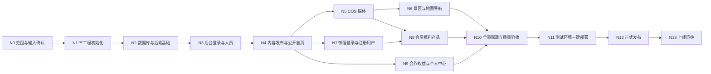

# 常清净文旅投｜实现步骤与节点计划

| 项目 | 内容 |
| --- | --- |
| 版本 | V1.0 |
| 日期 | 2026-09-08 |
| 关联文档 | [产品需求文档](product-requirements.md)、[技术设计文档](technical-design.md) |
| 目标 | 将后端、管理后台后端、管理后台前端和小程序拆成可开发、可联调、可验收的实现节点 |
| 当前状态 | N2 进行中：数据库核心表、Spring Session 表及 PostgreSQL 16 迁移测试已完成 |

## 1. 工作线与工程边界

实现过程按四条工作线跟踪，但实际只有三个独立工程：

| 工作线 | 所属工程 | 职责 |
| --- | --- | --- |
| 小程序后端 | `backend` | `/api/v1/app/**`、公开内容、微信登录、注册用户、福利内容、浏览统计 |
| 管理后台后端 | `backend` | `/api/v1/admin/**`、后台登录、权限、内容编辑发布、人员和用户管理、COS 与地图接入 |
| 管理后台前端 | `admin-web` | React + TypeScript + Vite 管理页面，部署到 `/admin/` |
| 小程序 | `miniprogram` | Taro + React + TypeScript，构建为微信小程序 |

小程序后端与管理后台后端位于同一个 Spring Boot 工程，共用数据库、领域服务和内容发布逻辑，但 Controller、DTO、路由、Spring Security 认证链及权限保持分离。不能为了开发方便，让管理接口接受小程序 token，或让小程序读取草稿内容。

本计划不把旧 UI 复刻为实现节点。功能按照产品文档实现，视觉方案单独设计并在对应页面节点验收。

## 2. 节点总览

固定主路径是 N0 → N1 → N2 → N3 → N4。N5 完成后，N6 与 N8 的页面工作可以并行；N7 可与 N5 部分并行。只有前置节点通过验收，依赖它的数据和接口才进入完成状态。

| 节点 | 名称 | 核心可验收结果 | 状态 |
| --- | --- | --- | --- |
| N0 | 范围与外部输入确认 | 第一版范围、字段和外部账号清单冻结 | [ ] |
| N1 | 三工程初始化 | 三个工程可在 macOS 启动和构建 | 已完成 |
| N2 | PostgreSQL 与后端基础 | 迁移、错误响应、两套安全链和健康检查可运行 | 进行中 |
| N3 | 后台登录与人员管理 | 管理员可登录并管理后台人员 | [ ] |
| N4 | 内容发布与公开首页闭环 | 后台发布公司介绍，小程序无需登录即可看到 | [ ] |
| N5 | 腾讯云 COS 媒体闭环 | 后台可安全上传并发布图片／视频，小程序可读取 | [ ] |
| N6 | 景区、地图选点与导航 | 后台选点改名，小程序准确展示并导航 | [ ] |
| N7 | 微信登录与注册用户 | 指定入口一键登录，首次注册、后续恢复，后台可查看用户 | [ ] |
| N8 | 会员福利产品 | 登录后浏览分类、搜索、列表和纯展示详情 | [ ] |
| N9 | 合作权益与个人中心 | 开放内容完成，所有未开放入口统一提示 | [ ] |
| N10 | 全量联调与质量验收 | 产品 AC、权限、兼容、弱网和安全检查通过 | [ ] |
| N11 | 测试环境一键部署 | 单域名、Docker、Nginx、HTTPS、续签和部署脚本通过 | [ ] |
| N12 | 正式发布 | 正式后端、管理后台和小程序完成上线验证 | [ ] |
| N13 | 上线运维 | 监控、备份、证书、回滚和内容维护进入常态 | [ ] |

## 3. 节点执行规则

每个节点按以下顺序执行：

1. 确认该节点前置条件和所需外部资料。
2. 先更新 OpenAPI、数据库迁移或页面交互约定，再实现调用方。
3. 后端和前端在固定契约下开发，前端可先使用与契约一致的 mock。
4. 完成该节点的自动检查、联调和人工验收。
5. 更新本文复选框、变更说明和未解决问题，再进入下一节点。

一个节点只有在“完成标准”全部满足后才算完成。代码写完但无法构建、接口只能用 mock、数据库迁移未验证、真机能力未测试，都不能把对应节点标为完成。

## 4. N0：范围与外部输入确认

### 目标

把会影响数据库、接口和页面结构的需求确定下来，避免进入实现后反复重做基础模型。

### 四条工作线

- 小程序后端：确认注册用户字段、手机号跨微信身份的绑定规则、个人中心实际返回字段。
- 管理后台后端：确认管理员与运营角色、注册用户完整手机号的查看权限、内容草稿／发布流程。
- 管理后台前端：确认采用 React + TypeScript + Vite，确认后台页面信息架构与地图选点交互。
- 小程序：确认全新视觉方向、底部四个入口、登录页、产品和景区详情的页面原型。

### 需要确认的内容

- 产品文档 Q-01 至 Q-11 中影响首版实现的项目。
- 小程序名称、主体类型、服务类目以及可用 AppID 情况。
- 首页、公司介绍、景区、产品、合作权益的正式或占位素材格式。
- 腾讯云 COS 和腾讯位置服务账号是否已创建；本节点不要求交付生产密钥。
- 一个业务域名按 `/admin/`、`/api/v1/admin/`、`/api/v1/app/` 使用。

### 产物

- [ ] 产品待定项形成明确结论或标记为首版不实现。
- [ ] 页面线框图和主要状态获得确认。
- [ ] OpenAPI 初始资源清单和数据库对象清单完成评审。
- [ ] 外部账号、素材及生产信息的负责人和最晚提供节点明确。

### 完成标准

开发所需字段不存在相互冲突的解释；所有未确认业务均明确排除或记录为后续功能，不能以“先做出来再说”进入首版。

## 5. N1：三个工程初始化

### 前置条件

N0 完成。macOS 已安装 JDK 18、Node.js、包管理器、Docker Desktop 和微信开发者工具。

### 小程序后端与管理后台后端

- 创建 `backend` Maven 工程，锁定 JDK 18 和 Spring Boot 3.2.12。
- 引入 Spring Web、Spring Security、Validation、Actuator、MyBatis-Plus Boot 3 Starter、PostgreSQL JDBC、Flyway、Spring Session JDBC、OpenAPI、腾讯云 COS SDK 的基础依赖。
- 设置 Maven Wrapper、编译参数、测试目录和 `local/test/prod` 配置边界。
- 建立 `/api/v1/app/**` 与 `/api/v1/admin/**` 包、Controller 和 SecurityFilterChain 骨架。
- 启动时检查必要配置组合，不允许生产环境启用 mock 登录。

### 管理后台前端

- 创建 `admin-web` React + TypeScript + Vite 工程。
- 配置生产 base `/admin/`、本地 API 代理、路由、布局、错误边界、代码检查和测试命令。
- 建立 OpenAPI 类型生成入口；不手写与契约重复的请求类型。

### 小程序

- 创建 `miniprogram` Taro + React + TypeScript 工程，锁定 Taro CLI 与各包一致版本。
- 配置开发、测试、正式 API 基址；AppID 不作为服务端秘密。
- 建立四个 Tab 页面骨架、请求层、登录状态容器和统一错误展示。
- 运行微信端 watch 构建，用微信开发者工具导入并打开模拟器。

### 交付与检查

- [x] `backend` 在 JDK 18 下完成编译、测试和启动。
- [x] 本地 PostgreSQL 通过 Docker Compose 启动，后端能连接。
- [x] `admin-web` 可运行、构建并通过 `/admin/` base 预览。
- [x] `miniprogram` 可构建并出现在微信开发者工具模拟器中；四个 Tab 页面加载正常。
- [x] 三个工程分别拥有依赖锁定或 Wrapper、环境示例和基础 README。
- [x] 仓库不存在 AppSecret、数据库密码、COS 永久密钥等真实秘密。

### 完成标准

新开发者按照文档可在 macOS 启动三工程；CI 或等效本地检查能分别构建三个工程；微信模拟器能显示四个空页面且无构建错误。

## 6. N2：PostgreSQL 与后端公共基础

### 前置条件

N1 完成。

### 小程序后端

- 定义统一成功／错误响应、traceId、参数校验、分页、时间和 UUID 约定。
- 建立公开接口、注册用户接口、Bearer 会话接口的安全边界骨架。
- 添加存活与就绪健康检查；详细 Actuator 信息不公开。

### 管理后台后端

- 建立后台 Cookie 会话、CSRF、角色权限和默认拒绝策略骨架。
- 小程序 Bearer 与后台 Cookie 使用不同 SecurityFilterChain，互不接受对方凭据。
- 建立后台审计事件写入能力。

### 数据库

- 用 Flyway 创建用户、微信身份、手机号、应用会话、后台人员、内容、内容版本、媒体、景区统计和审计表。
- 落实 UUID、`timestamptz`、外键、唯一约束、CHECK、索引和乐观锁字段。
- MyBatis-Plus 处理常规实体查询；版本发布、行锁、统计去重等使用显式 SQL。
- Spring Session JDBC 表由 Flyway 管理，关闭生产自动建表。

### 两个前端

- 只接入基础错误响应和 traceId 展示，不提前实现业务页面。
- 生成并验证公共 API 类型。

### 交付与检查

- [x] 空数据库可以从零执行全部迁移，重复启动不重复建表。
- [x] PostgreSQL 集成测试使用真实 PostgreSQL，不用 H2 代替。
- [ ] 未认证访问受保护接口返回 401，无权限返回 403，未知管理接口默认拒绝。
- [ ] 后台 Cookie 不能访问小程序受保护接口，小程序 token 不能访问管理接口。
- [ ] 日志不包含密码、token、手机号或微信临时 code。

### 完成标准

后端基础约定稳定，数据库可以全新安装并通过集成测试，两条安全链的隔离有自动化测试证据。

## 7. N3：后台登录与人员管理

### 前置条件

N2 完成。确认管理员、运营角色和权限。

### 小程序后端与小程序

本节点不增加业务功能，只保持构建和安全回归通过。

### 管理后台后端

- 实现一次性首个管理员初始化命令，不提供默认公开密码。
- 实现 CSRF 初始化、登录、当前人员、退出接口。
- 实现人员列表、新增、修改角色、启用／停用、重置密码。
- 密码使用 BCrypt 等自适应哈希；登录、重置密码、停用和角色变化正确撤销会话。
- 使用事务和锁防止最后一个有效管理员被并发停用或降权。

### 管理后台前端

- 完成登录页、退出、会话过期处理、无权限页和管理框架布局。
- 完成人员列表、搜索、新增、编辑、启停和重置密码页面。
- Cookie 会话不写入 localStorage；写请求统一携带 CSRF token。
- 菜单按权限显示，403 与会话失效分别处理。

### 交付与检查

- [ ] 初始管理员可安全创建并首次登录。
- [ ] 管理员能管理人员，运营无法访问人员菜单或接口。
- [ ] 停用人员、重置密码、角色变更后旧会话失效。
- [ ] 不能停用或降权最后一个有效管理员。
- [ ] 登录失败不泄漏账号是否存在；连续失败受到限流。

### 完成标准

管理员可通过管理网页完成完整人员管理，服务端权限测试和浏览器端到端测试通过。

## 8. N4：内容版本、公司介绍与公开首页闭环

### 前置条件

N3 完成。至少有一名可发布内容的后台人员。

### 小程序后端

- 实现公开的首页聚合和公司介绍详情接口。
- 只返回已发布版本；无内容时返回约定空状态，不返回草稿。
- 确保首页请求不创建用户、不触发微信登录。

### 管理后台后端

- 实现内容条目、不可变版本、草稿、预览、发布、下架和乐观锁。
- 先支持公司介绍和首页基础配置；记录修改人、发布时间和发布审计。
- 并发编辑冲突返回 409，草稿保存不影响线上版本。

### 管理后台前端

- 完成公司介绍编辑、结构化图文、保存草稿、预览、发布和下架页面。
- 明确展示“当前线上版本”和“未发布草稿”；离开未保存表单时提示。
- 完成首页基础配置入口，视频文件接入留到 N5。

### 小程序

- 完成首页结构、公司介绍卡片和公司详情页。
- 游客直接访问，不弹登录；实现加载中、空内容、失败重试。
- 先使用可发布的文字和占位图片验证完整链路。

### 交付与检查

- [ ] 后台保存草稿后，小程序仍展示旧版本。
- [ ] 后台发布后，小程序刷新可见新版本，无需重新发布小程序代码。
- [ ] 下架后公开接口和旧链接不再返回正文。
- [ ] 两人并发编辑时后保存者收到冲突提示，不静默覆盖。
- [ ] 后台预览需要后台权限，游客无法读取草稿。

### 完成标准

完成第一个端到端闭环：后台登录 → 编辑公司介绍 → 保存／预览／发布 → 小程序匿名读取。

## 9. N5：腾讯云 COS 媒体闭环

### 前置条件

N4 完成。最晚在联调前提供开发用 COS Bucket、Region 及最小权限服务端凭据；明确初始图片、视频格式与大小限制。

### 小程序后端

- 将已发布内容中的 COS Object Key 解析为短期访问地址。
- 公开内容可匿名取得相应媒体地址；受保护产品媒体必须经登录接口返回。
- 支持签名过期后的内容刷新，不在日志打印签名 URL 的敏感查询参数。

### 管理后台后端

- 使用腾讯云 COS SDK 和临时密钥服务创建最小权限上传任务。
- 实现上传完成确认、对象元数据复核、媒体状态和失败清理。
- 发布前验证资源为 READY；失败上传不能替换线上有效资源。
- 建立内容版本与媒体引用关系，防止清理仍被草稿或已发布版本使用的文件。

### 管理后台前端

- 实现图片／视频上传、进度、校验中、成功、失败和重试状态。
- 浏览器使用临时凭证直传 COS，不接触永久 SecretId／SecretKey。
- 完成宣传视频、封面、公司介绍图片的排序、预览和发布。

### 小程序

- 完成首页宣传视频封面、播放、暂停、全屏和失败重试。
- 验证公司介绍多图展示、图片比例和签名过期刷新。
- 微信开发者工具模拟器先验收，再进行 iOS、Android 真机媒体测试。

### 交付与检查

- [ ] COS CORS 只允许实际管理后台来源，临时凭证只允许指定 Object Key。
- [ ] 伪造扩展名、超限文件和未完成上传不能进入 READY 或发布。
- [ ] 视频支持 Range 请求并在真机正常播放。
- [ ] 替换媒体失败时，线上原视频／图片保持可用。
- [ ] 清理任务不会删除仍被引用的文件。

### 完成标准

后台可以安全上传并发布宣传视频和图文图片，小程序能稳定读取；COS 永久密钥未进入任何前端产物。

## 10. N6：景区、后台地图选点与小程序导航

### 前置条件

N5 完成。提供开发用腾讯位置服务 key，并确认地图账号可使用所需网页能力。

### 小程序后端

- 实现景区分页列表、详情和浏览次数接口。
- 返回已发布版本的标题、图文、开放状态、展示名称、详细地址和 GCJ-02 坐标。
- 使用 `viewId` 对同次打开去重，后台预览不计数。

### 管理后台后端

- 实现景区草稿／发布校验和地图选点确认接口。
- 分开保存地图原始名称、详细地址、坐标、自定义展示名称及是否自定义。
- 只改展示名称时复用原坐标；改变坐标必须经过重新选点确认。
- 发布前检查有效坐标、展示名称和媒体状态。

### 管理后台前端

- 完成景区列表、编辑、图文、开放状态、排序、预览与发布。
- 地图弹窗支持搜索、选点、确认、取消和已有标记回显。
- 清楚展示原始地点名称与小程序展示名称；取消弹窗不污染原坐标。

### 小程序

- 完成景区列表和详情：标题、发布时间、浏览量、图文、开放状态、地址卡片。
- “开始导航”按保存的坐标调用微信位置接口，不根据展示名称重新搜索。
- 导航失败可重试并允许复制地址；不要求首页预先获取用户定位。

### 交付与检查

- [ ] 仅修改展示名称后，地图坐标与详细地址保持不变。
- [ ] 重新选点确认后坐标改变；取消选点保持原值。
- [ ] 暂停开放和内容下架是两个独立状态。
- [ ] iOS、Android 到达正确目的地；记录实际出现的可用导航应用。
- [ ] 浏览计数符合产品约定，重试和后台预览不重复增加。

### 完成标准

后台地图选点、独立改名、发布和小程序真机导航形成完整闭环，目的地无坐标系偏移。

## 11. N7：微信手机号登录、自动注册与注册用户

### 前置条件

N4 完成。真机联调前提供小程序 AppID、AppSecret；小程序主体和认证状态支持手机号能力，并准备相应调用额度。

### 小程序后端

- 实现微信身份恢复接口和手机号授权注册登录接口。
- 分别验证 `loginCode` 与 `phoneCode`，不接受客户端自行提交的 openid 或明文手机号作为认证依据。
- 首次创建用户，后续按微信身份进入原账号；数据库唯一约束防重复注册。
- 手机号加密保存，查询使用带密钥摘要，接口只返回脱敏手机号。
- 生成随机 Bearer token，只保存摘要、到期和撤销状态。
- 自动恢复只恢复已注册用户，不在游客首页创建账号。

### 管理后台后端

- 实现注册用户列表、按权限查询和详情接口。
- 默认手机号脱敏；不返回微信 session key、token 摘要或内部凭据。
- 记录注册时间与最近登录时间，不增加余额、功德或会员升级操作。

### 管理后台前端

- 完成注册用户列表、查询和详情页。
- 按角色隐藏并禁止无权限路由；手机号显示遵循最终权限规则。
- 正确展示用户状态、注册时间、最近登录时间和绑定状态。

### 小程序

- 未登录点击会员福利时展示登录引导；取消、返回或拒绝手机号授权后切换首页。
- 个人中心提供手动登录；成功后停留个人中心，取消后回首页。
- 已注册用户优先恢复登录，不重复索取手机号；恢复失败不阻塞公开页面。
- 合并多个并发 401 为一次恢复流程，避免重复弹授权。

### 交付与检查

- [ ] 游客浏览首页、景区和合作权益时无登录弹窗、无用户记录。
- [ ] 首次授权只创建一个用户，重复请求和再次登录不产生重复账号。
- [ ] 会员福利入口与个人中心两条登录路径行为符合产品规则。
- [ ] 拒绝授权回首页；网络失败留在登录流程并可重试，不误判为取消。
- [ ] 前后端日志没有完整手机号、微信临时 code、AppSecret 或业务 token。
- [ ] 后台只能由授权人员查看注册用户。

### 完成标准

微信开发者工具和真机完成注册、恢复、拒绝、失败和重复请求测试；后台可查询真实测试注册用户。

## 12. N8：会员福利产品

### 前置条件

N5 和 N7 完成。确认是否保留搜索和多分类；准备至少两个分类、六个含多图详情的测试产品。

### 小程序后端

- 实现需登录的分类、产品分页、关键词搜索和产品详情接口。
- 只返回已发布／上架产品和已发布版本；分类与关键词同时筛选。
- 旧链接访问已下架产品返回 404；无登录返回 401。

### 管理后台后端

- 实现产品分类和产品的草稿、发布／上下架、排序、关联和校验。
- 产品支持列表封面、名称、简介、详情多图、图文内容和可选规格。
- 停用分类只隐藏分类入口，产品是否展示由产品状态决定。
- 不创建价格、库存、购物车、订单、支付或领取相关接口和表。

### 管理后台前端

- 完成分类列表和编辑。
- 完成产品列表、筛选、编辑、多图排序、预览、上架和下架。
- 发布前显示字段和媒体校验错误，避免空产品上线。

### 小程序

- 完成产品分类、搜索、双列／最终设计列表、分页和详情。
- 列表使用一张封面，详情支持多张图片、名称、说明和规格。
- 产品页面无购买、领取、联系咨询等功能。
- 直接访问产品链接时先登录；成功回目标详情，取消回首页。

### 交付与检查

- [ ] 未登录不能通过页面或直接接口获得产品正文。
- [ ] 登录后分类、搜索、分页和详情结果一致。
- [ ] 产品上下架、分类停用和旧链接行为符合规则。
- [ ] 详情只展示内容，没有交易相关入口或后端数据结构。
- [ ] 空结果、加载失败、没有更多内容和长图文状态完整。

### 完成标准

运营可在后台独立完成产品分类和产品发布，已登录用户在小程序完成纯展示浏览全流程。

## 13. N9：合作权益、个人中心和暂未开放入口

### 前置条件

N4 完成；个人中心登录态依赖 N7，最终合并验收在 N10。

### 小程序后端

- 实现公开合作权益接口和已登录用户本人资料接口。
- 本人资料不接受任意用户 ID；未定义的会员等级、余额和功德不伪造业务数据。

### 管理后台后端

- 实现合作权益草稿、预览、发布与下架。
- 支持收益板块标题、说明、图标、排序及合作价值图文。
- 分公司方案和会员体系保持代码定义的暂未开放状态，后台不能绕过版本范围开启。

### 管理后台前端

- 完成合作权益图文与板块编辑、排序、预览和发布。
- 明确提示分公司方案、会员体系当前无法开放。

### 小程序

- 完成合作权益开放内容页面。
- 分公司方案、会员体系点击提示“敬请期待”，不切换空白内容。
- 完成个人中心未登录和已登录状态。
- 会员空间、成为会员、我的订单、充值记录、地址管理、我的推荐统一提示“敬请期待”，不触发登录或进入空页面。

### 完成标准

合作权益内容可由后台发布，个人中心能反映真实登录状态，所有暂未开放入口行为一致且不存在未实现接口调用。

## 14. N10：全量联调、安全与质量验收

### 前置条件

N6、N8、N9 完成。

### 四条工作线共同任务

- 按产品文档 AC-01 至 AC-22 逐条验收并记录结果。
- 固化 OpenAPI，验证两个前端的生成类型与实际后端响应一致。
- 运行后端单元测试、PostgreSQL 集成测试、权限测试和关键并发测试。
- 运行管理后台组件／端到端测试、小程序逻辑测试和两端构建检查。
- 使用真实视频、多图长文、长地址、空数据、无权限、弱网和接口异常测试。
- 检查依赖、日志脱敏、CSRF、CORS、上传临时凭证、限流、安全响应头和秘密扫描。
- 完成 iOS、Android 真机测试：手机号授权、取消回首页、视频、导航、长页面和安全区域。

### 缺陷门槛

- [ ] 核心流程阻断、权限绕过、数据丢失、秘密泄漏、错误坐标等严重缺陷为零。
- [ ] 普通缺陷有明确处理结果；延后项不影响第一版成功标准，并记录原因。
- [ ] 所有构建和必要测试通过，数据库可从零迁移。
- [ ] 真实素材容量与上传限制已经验证并写入后台提示。

### 完成标准

第一版功能和非功能验收通过，形成可部署的后端镜像、管理前端产物和小程序构建结果。

## 15. N11：腾讯云 Ubuntu 测试环境一键部署

### 前置条件

N10 完成。最晚此时提供测试／正式服务器访问方式、真实域名、DNS 控制权、证书邮箱、COS 生产配置和防火墙操作权限。

### 部署实现

- 创建 `deploy/compose.production.yaml`、Nginx 配置、环境示例、Certbot webroot 共享卷和证书卷。
- 实现统一入口 `deploy/deploy.sh`：`bootstrap`、`deploy`、`renew-cert`、`status`。
- `bootstrap` 检查 Ubuntu、Docker、域名解析、80/443 端口，首次申请证书并安装 systemd timer。
- `deploy` 先备份／检查，执行 Flyway 迁移 job，再更新容器并做健康检查；失败停止发布并保留上一版应用标识。
- `renew-cert` 执行 Certbot 续签，成功后 `nginx -t` 并 reload Nginx。
- Nginx 在同一域名下提供 `/admin/`，转发 `/api/v1/admin/` 和 `/api/v1/app/`。
- PostgreSQL 不暴露公网端口；生产秘密只在服务器非仓库环境文件中。

### 四端部署验证

- 小程序后端：HTTPS 公开接口、受保护接口、微信服务调用和 COS 地址正常。
- 管理后台后端：Cookie、CSRF、权限、上传和发布正常。
- 管理后台前端：刷新任意 `/admin/*` 路由不出现 404，静态资源 base 正确。
- 小程序：配置正式合法域名后，用体验版连接测试环境完成真机流程。

### 完成标准

- [ ] 一条 `deploy.sh` 命令可重复发布，不要求人工逐个执行容器命令。
- [ ] 首次证书签发成功；运行续签 dry-run 或等效测试后 Nginx 可正确 reload。
- [ ] 重启服务器后服务、证书卷和 PostgreSQL 数据仍存在，容器按策略恢复。
- [ ] 数据库备份实际生成，并完成至少一次恢复演练。
- [ ] 测试环境端到端验收通过。

## 16. N12：正式环境与微信小程序发布

### 前置条件

N11 完成；小程序备案、域名备案、认证、类目、隐私保护指引和手机号能力满足平台要求；正式内容已确认。

### 发布步骤

1. 冻结第一版 OpenAPI 和数据库迁移，生成正式发布版本号。
2. 通过一键脚本部署正式 PostgreSQL、后端、管理前端、Nginx 和证书配置。
3. 管理员登录正式后台，录入并发布正式视频、公司、景区、产品和合作权益内容。
4. 在微信后台配置唯一业务域名和实际 COS 合法域名。
5. 构建小程序正式版，检查 AppID、API 地址和关闭 mock。
6. 上传开发版本，设置体验版，在正式后端上完成全流程回归。
7. 提交微信审核；需要时提供审核操作说明。
8. 审核通过后发布，并用普通用户环境完成上线核验。

### 完成标准

- [ ] 管理后台和后端正式服务稳定，证书有效且续签定时器启用。
- [ ] 数据库与 COS 备份／保留策略生效。
- [ ] 小程序审核通过并正式发布。
- [ ] 首页匿名访问、景区导航、两处登录入口、福利产品、后台发布均完成线上抽查。
- [ ] 发布版本、迁移版本、镜像和管理前端产物可追溯。

## 17. N13：上线运维与后续迭代入口

### 日常检查

- 每日关注服务健康、错误率、登录／微信接口错误、COS 上传失败和证书续签状态。
- 定期检查 PostgreSQL 备份、COS 内容保留和恢复能力。
- 内容更新继续遵守保存草稿 → 预览 → 发布，不能直接修改数据库。
- 后端接口保持对尚未更新的小程序客户端兼容。
- 依赖和镜像安全更新单独验证；JDK 18 与 Spring Boot 3.2.12 的升级风险持续记录。

### 故障处理入口

- 应用发布失败：回退上一版后端镜像或管理前端产物，数据库采用前向修复。
- 数据异常：停止相关写入，保留日志和快照，按备份恢复流程处理。
- COS 媒体异常：先保持内容版本不变，修复资源或重新上传后再发布。
- 证书续签异常：检查 DNS、80 端口、ACME webroot 和 Certbot 日志，在到期前人工干预。

### 后续功能

会员空间、付费会员、订单、充值、地址、推荐、余额和功德等继续作为独立版本评审。新增这些功能前必须重新设计数据库、权限、支付／资金安全及审核合规，不能直接在第一版占位字段上补几个接口上线。

## 18. 外部资料最晚提供节点

| 资料 | 可先使用的替代 | 最晚节点 |
| --- | --- | --- |
| 管理后台 React + TypeScript + Vite 最终确认 | 按当前技术建议初始化 | N0 |
| 小程序 AppID | 测试号／开发配置 | N1 用于项目配置；真实手机号联调最晚 N7 |
| AppSecret、手机号能力与额度 | 微信服务 mock | N7 真机联调前 |
| COS Bucket、Region、最小权限凭据 | 媒体服务本地 mock | N5 联调前 |
| 腾讯位置服务 key | 静态坐标 mock | N6 联调前 |
| UI 风格、品牌与页面原型 | 功能线框和占位样式 | 相应页面节点开始前 |
| 正式视频、图片和文案 | 测试素材 | N10 容量测试前，正式内容最晚 N12 |
| 腾讯云 Ubuntu 访问方式和配置 | 本地 Docker Compose | N11 |
| 真实业务域名、DNS 权限、证书邮箱 | 本地域名／HTTP | N11 |
| 小程序备案、认证、类目和隐私资料 | 测试环境验证 | N12 提审前 |

## 19. 全项目完成定义

第一版只有同时满足以下条件才算完成：

- 产品需求范围内的开放功能全部实现，暂未开放入口行为正确。
- 后端、管理后台后端、管理前端和小程序分别通过构建与相应测试。
- 数据库迁移可从零执行，重要约束和并发场景有 PostgreSQL 集成测试。
- 管理后台可独立维护并发布视频、公司、景区、产品和合作权益内容。
- 微信登录在指定入口工作，拒绝授权回首页，游客公开浏览不被强制登录。
- 地图选点、展示名称修改和真机导航符合产品规则。
- 腾讯云 COS 不泄漏永久密钥，媒体上传、引用和失败恢复正常。
- 腾讯云 Ubuntu 上一键部署、HTTPS、自动续签、备份、健康检查和回退方案经过验证。
- 微信小程序审核通过并正式发布，线上核心流程抽查通过。

节点是验收边界，不等同固定日期。实际排期应在 N0 完成、人员投入和正式素材规模明确后制定；不得通过跳过验证来压缩节点。
