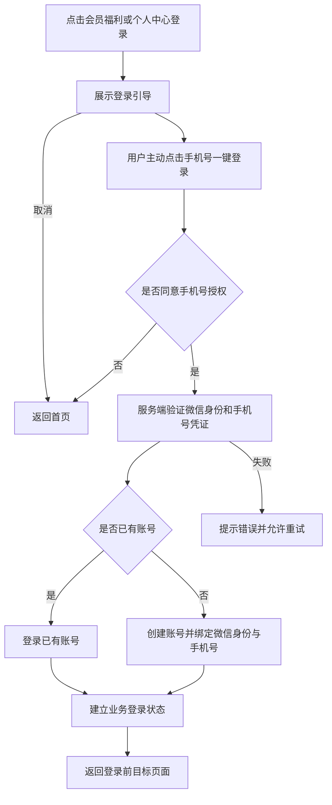

# 常清净文旅投小程序及管理后台｜产品需求文档

| 项目 | 内容 |
| --- | --- |
| 版本 | V1.0 需求初稿 |
| 日期 | 2026-09-08 |
| 产品名称 | 常清净文旅投（沿用参考产品名称，正式名称可调整） |
| 产品范围 | 微信小程序 + 网页管理后台 |
| 后端方向 | Java Spring Boot |
| 工程边界 | 小程序、后端（含管理后台 API）、管理后台前端三个独立工程 |
| 数据库 | PostgreSQL |
| 小程序技术方案 | Taro + React + TypeScript |
| 文档状态 | 已确认需求与补充设计并列记录，待定项集中列于第 12 节 |

## 1. 产品目标与需求依据

第一版提供公司与景区信息展示、会员福利产品展示、合作权益介绍，通过指定入口引导用户注册，并让工作人员能够在网页后台独立维护内容和查看注册用户。

本文依据本轮产品讨论及用户提供的六张截图整理。截图仅作为功能参考，**不沿用旧版 UI**；颜色、布局、字体、图标、卡片和导航样式重新设计。

需求标记约定：

- **已确认**：用户已明确提出或回答确认的功能与规则。
- **参考功能**：截图中存在，作为本版设计基础；具体业务含义仍可调整。
- **补充设计**：为使流程完整而提出的默认方案，不代表用户已逐项确认。
- **待定**：信息不足，不应自行扩展为完整业务系统。

本版成功标准：游客可以浏览公开内容；指定入口能够完成手机号授权注册和后续登录；登录用户可以浏览福利产品；用户能查看景区并打开正确的导航目的地；工作人员可以通过后台更新内容并管理后台账号。

## 2. 第一版范围

### 2.1 开放功能

| 模块 | 第一版功能 | 依据 |
| --- | --- | --- |
| 首页 | 宣传视频、公司介绍、景区介绍入口 | 已确认 |
| 景区详情 | 图文介绍、地点展示、地图导航 | 已确认 |
| 景区详情附加信息 | 发布时间、浏览量、开放状态 | 参考功能 |
| 会员专区 | 会员福利入口及登录引导 | 已确认 |
| 福利产品 | 列表、单张列表封面、名称、简介、多图详情 | 已确认 |
| 福利产品检索 | 搜索、分类 | 参考功能，具体交互见第 5 节 |
| 合作权益 | 收益板块与合作价值内容展示 | 参考功能 |
| 个人中心 | 未登录状态、手动登录、登录后的用户资料 | 已确认 |
| 管理后台 | 管理人员、查看注册用户、维护首页和景区等内容 | 已确认 |
| 后台内容范围 | 同时维护福利产品及合作权益 | 补充设计，与小程序展示内容对应 |

### 2.2 暂未开放功能

| 所在页面 | 功能入口 |
| --- | --- |
| 会员专区 | 会员空间 |
| 合作权益 | 分公司方案、会员体系 |
| 个人中心 | 成为会员、我的订单、充值记录、地址管理、我的推荐 |

上述入口保留，点击统一显示“敬请期待”，不跳转到空白页面，不触发登录、支付或其他业务操作。统一交互为补充设计，合作权益两个标签的提示文案为已确认要求。

本版不开发购买、购物车、领取、支付、订单处理、充值、余额交易、积分／功德累计、付费会员升级、推荐奖励等业务。福利产品仅展示，不添加联系咨询或其他转化按钮。

### 2.3 用户与权限

| 角色 | 可使用范围 |
| --- | --- |
| 游客 | 首页、公司介绍、景区详情及导航、会员专区入口、合作权益、个人中心未登录页面 |
| 已登录注册用户 | 游客功能 + 福利产品列表与详情 + 本人资料 |
| 后台管理员 | 后台人员、注册用户查看、所有内容维护；角色设计待确认 |
| 后台运营人员 | 内容维护；默认不开放后台人员管理和注册用户手机号查看，权限待确认 |

注册用户与后台工作人员是两类账号。第一版注册成功只代表建立用户账号，不代表开通付费会员或获得任何收益权益。

## 3. 页面与导航结构

```text
微信小程序
├── 首页
│   ├── 宣传视频播放
│   ├── 公司介绍详情
│   └── 景区卡片 → 景区详情 → 地图／导航
├── 会员专区
│   ├── 会员福利 → 登录校验 → 产品列表 → 产品详情
│   └── 会员空间 → 敬请期待
├── 合作权益
│   ├── 收益板块与合作价值
│   ├── 分公司方案 → 敬请期待
│   └── 会员体系 → 敬请期待
└── 个人中心
    ├── 未登录 → 微信手机号一键登录
    ├── 已登录 → 用户资料
    └── 暂未开放入口 → 敬请期待

网页管理后台
├── 登录
├── 首页宣传视频：视频列表、新增、发布／下架、删除
├── 公司介绍：页面信息、可排序业务板块
├── 景区管理：图文、状态、地图选点、展示名称
├── 福利产品：分类、产品、图片、详情
├── 合作权益：收益板块、合作价值
├── 注册用户：用户列表、用户详情
└── 后台人员：账号、角色、启用／停用
```

底部保留首页、会员专区、合作权益、个人中心四个一级入口。二级页面使用返回导航；是否延续底部导航交由新 UI 设计决定，不要求复制旧图中的悬浮导航样式。

## 4. 登录与注册

### 4.1 触发规则

| 场景 | 行为 | 依据 |
| --- | --- | --- |
| 首次进入首页 | 直接展示，不弹登录、不要求手机号 | 已确认 |
| 打开会员专区 | 展示入口，不立即要求登录 | 已确认 |
| 未登录，点击会员福利 | 展示登录引导 | 已确认 |
| 已登录，点击会员福利 | 直接打开产品列表 | 已确认 |
| 未登录，进入个人中心 | 展示未登录状态，提供手动登录按钮 | 已确认 |
| 福利入口登录成功 | 打开原本要访问的产品列表 | 补充设计 |
| 个人中心登录成功 | 留在个人中心并刷新资料 | 补充设计 |
| 取消登录或拒绝手机号授权 | 返回首页，并选中首页导航 | 已确认 |
| 网络或接口失败 | 保持登录界面，提示重试；不视为主动取消 | 补充设计 |

登录界面提供明确的“微信手机号一键登录”和取消操作，以及可阅读的用户协议、隐私说明。不得预先获取手机号或把取消当成授权。

### 4.2 首次登录



微信身份凭证与手机号授权凭证分别由后端验证，不混用。重复点击、请求重试或再次登录不能重复创建账号。不同微信身份与同一手机号发生关联冲突时，不默认合并账号，处理方案见待定项。

手机号授权不会自动带来微信头像和昵称。补充设计：第一版使用默认头像及生成的显示昵称，不增加独立的资料编辑流程。

### 4.3 后续自动登录

- 已注册用户再次进入时，优先恢复有效登录状态，不反复要求手机号授权。
- 登录状态失效时，尝试通过微信身份恢复已有账号的登录；恢复失败后，在需要登录的入口重新引导。
- 恢复失败不阻塞首页及其他公开页面，也不在首页自动弹出授权界面。
- 自动恢复仅用于已有注册用户，不在游客首次浏览首页时自动创建用户账号。
- 如后续增加主动退出登录功能，应尊重退出状态，不立即自动登录回来；退出入口是否纳入本版尚未确定。

### 4.4 福利内容的访问控制（补充设计）

产品列表、搜索、分类查询及产品详情使用同一套登录校验。通过分享链接或其他路径直接打开产品详情，也应先完成登录，成功后返回目标产品；取消后回首页。第一版不额外建设推广、推荐奖励等分享业务。

访问控制同时覆盖小程序页面和后端产品接口，不能只通过隐藏入口限制访问。目标产品已下架或删除时，显示“该产品暂不可查看”并提供返回列表的入口。

## 5. 小程序详细需求

### 5.1 首页与公司介绍

- 宣传视频：首页展示当前已发布视频的封面，用户点击后播放，支持暂停与全屏；默认不自动有声播放。后台可以保留多条宣传视频记录，但首页同一时间只展示一条；发布另一条时自动替换当前展示视频。
- 公司介绍：首页显示封面、标题和简介，点击进入完整图文介绍。独立详情页为补充设计，完整文案由后台维护。
- 景区区域：按后台设置的顺序展示已发布景区的封面、名称和简短介绍，点击进入景区详情。支持多条景区记录为补充设计。
- 无已发布内容的可选模块不显示空卡片；视频加载失败提供重试，不影响其他内容浏览。

### 5.2 景区详情

| 内容 | 展示与交互 |
| --- | --- |
| 标题 | 景区或文章标题 |
| 发布时间 | 首次发布时间；普通内容编辑不重置首次发布时间 |
| 浏览量 | 系统累计详情访问次数，统计口径见第 9 节 |
| 图文内容 | 支持文字、多张图片及排列顺序 |
| 开放状态 | 正常开放／暂停开放；状态名称为补充设计，可按业务调整 |
| 地点卡片 | 自定义地点展示名称、地图选点得到的详细地址 |
| 开始导航 | 打开已保存坐标对应的地图位置，再使用平台导航能力 |

景区开放状态与文章发布状态相互独立：暂停开放的景区仍可展示介绍和状态；下架文章则不再供前台访问。默认暂停开放仍允许查看地图，以便用户了解位置。

导航按钮只使用已保存的目的地坐标，不根据自定义名称重新搜索地点。后台坐标采用与微信位置接口兼容的坐标体系，避免选点位置与实际导航位置偏移。

导航能力边界：标准流程为打开微信内置地图，再通过地图的导航入口选择可用导航方式。百度、高德等第三方应用是否出现在选项中，由微信版本、操作系统和已安装应用决定；不承诺所有设备出现固定软件列表。该边界须在真机验证后确定最终交互。地图无法打开时提示重试，可提供复制地址作为补充方案。

### 5.3 会员专区

- “会员福利”：按第 4 节规则校验登录后进入产品列表。
- “会员空间”：保留入口并标注暂未开放，点击“敬请期待”，不触发登录。
- 本版没有会员购买、等级升级或会员空间内容。

### 5.4 福利产品列表与详情

产品列表：展示已上架产品；每条使用一张列表封面、名称和简短介绍，按后台设置排序。采用分页加载，支持加载中、加载失败重试和没有更多内容状态。

搜索与分类为参考功能及补充设计：默认“全部”，有有效分类时展示其他分类；按产品名称搜索，并与当前分类一起筛选。无结果时显示清晰提示并允许清空搜索条件。

产品详情：展示名称、多张图片、详细介绍和按需填写的材质／规格等信息。列表封面与详情图片分别维护；详情图片可以包含封面，也可独立设置。

**详情只有内容展示，不提供购买、咨询、领取、购物车、价格计算或其他业务操作。**不因未来可能交易而提前设计订单、库存和支付流程。

### 5.5 合作权益

- 默认展示“收益板块”，保留截图所示七个板块：招商收益、招募收益、基础业务、供应链、衍生业务、特色服务、增项板块。
- 展示“合作价值”图文内容；原图未完整展示的文字不自行补造。
- 标题、说明、图标和排序可由后台维护；本版均为介绍内容，不提供投资、签约、返佣或收益计算功能。
- “收益板块”“分公司方案”“会员体系”在同一页面内切换。选择后两项时，以“敬请期待”模块替换核心收益区域，不跳转新页面。
- 核心收益和合作价值总结的子条目均为单层静态信息，不提供点击或详情；切换到分公司方案或会员体系后，合作价值总结继续保留。
- 截图文案作为待录入内容参考，正式上线文案由业务负责人提供。

### 5.6 个人中心

| 状态 | 展示与操作 |
| --- | --- |
| 未登录 | 默认头像、未登录提示、手机号未绑定提示、微信一键登录按钮 |
| 已登录 | 头像、显示昵称、脱敏手机号，以及确认启用的用户信息字段 |
| 登录处理中 | 显示处理状态，防止重复提交 |
| 登录失败 | 提示原因或重试，不展示为已登录 |

参考图包含会员等级、余额、功德、会员号，但这些字段的业务含义尚未定义。建议首版未登录时统一用“—”占位，不把游客显示为普通会员；登录后无业务依据的余额、功德不伪造为真实账户资产，可标“暂未开放”。字段是否全部保留、会员号是否生成及规则，见待定项。

“成为会员、我的订单、充值记录、地址管理、我的推荐”入口均为暂未开放，点击显示“敬请期待”。不建设对应表单、数据列表或后台业务。

## 6. 网页管理后台

后台主要面向电脑浏览器。以工作人员无需修改代码即可维护内容为目标，以下操作方式为补充设计。

### 6.1 后台登录与人员管理

- 第一版建议使用独立的账号密码登录，与小程序手机号登录分开。
- 管理员可以新增工作人员、设置显示姓名和角色、启用／停用账号、重置密码。
- 账号唯一；列表支持按账号、姓名和状态查询。
- 停用后不能登录，已有会话在后续请求时失效；隐藏菜单与服务端权限校验同步生效。
- 不允许停用最后一个有效管理员，避免后台无法管理。
- 人员管理暂按“后台工作人员账号管理”理解，不扩展员工档案、考勤或人事管理；需要业务确认。

建议权限表：

| 操作 | 管理员 | 运营人员 |
| --- | --- | --- |
| 维护首页、景区、产品、合作权益 | 是 | 是 |
| 发布／下架内容 | 是 | 是，首版暂不设置审批流 |
| 查看注册用户列表与详情 | 是 | 默认否，待确认 |
| 新增／停用工作人员、设置角色 | 是 | 否 |

### 6.2 首页内容管理

| 内容 | 编辑项 | 操作 |
| --- | --- | --- |
| 宣传视频 | 视频标题、视频文件、封面 | 列表查询、新增、编辑、播放预览、发布、下架、删除 |
| 公司介绍 | 标题、列表封面、简介、可排序业务板块 | 编辑、增加／删除板块、预览、保存、发布 |
| 景区展示区域 | 引用景区管理中的已发布内容 | 调整景区顺序、控制景区发布状态 |

宣传视频列表支持按标题和“草稿／展示中／已下架”状态查询。发布某条视频会自动替换首页当前视频；展示中的视频必须先下架才能删除。视频上传失败不能替换当前有效视频。

公司介绍采用面向运营人员的业务板块编辑方式，不要求工作人员理解 HTML 或底层内容块。每个板块维护标题、正文和可选图片，支持增加、删除和排序；例如“公司简介”“企业定位”“核心实力”，运营人员可继续新增“企业文化”等板块。

### 6.3 景区管理与地图选点

景区列表支持按标题和发布状态查询，可新增、编辑、预览、发布、下架。每条记录维护封面、标题、简介、图文介绍、开放状态和排序；导航地点为可选配置。

不配置地图时，景区仍可保存、发布并正常展示，只是不显示导航入口。需要导航时再完成以下选点流程：

地图选点流程：

1. 在景区编辑页点击“选择地图位置”，打开地图面板。
2. 输入关键词搜索地点，或在地图上选择位置，查看标记及详细地址。
3. 点击“确认位置”，回填地图原始名称、详细地址、经度、纬度及坐标体系。
4. “小程序展示名称”默认填入地图名称，工作人员可单独修改。
5. 预览地点卡片，确认展示名称和位置准确后保存／发布。

数据修改约束：

- 自定义展示名称与地图原始名称分别保存。
- 改展示名称不会修改坐标、详细地址，也不会重新调用名称搜索来决定坐标。
- 坐标由选点产生，普通编辑表单不提供手工改经纬度入口。
- 修改实际目的地必须重新选点并明确确认；取消选点保持原位置不变。
- 重新选点后，如果已有自定义展示名称，保留该名称并提示核对；未自定义则随新地点更新默认名称。
- 重新打开编辑页时，地图回显已保存的标记，展示名称不会覆盖地图原始地点名称。
- 已配置导航地点时，经纬度、地址和展示名称必须作为一组完整数据保存；未配置时不阻止发布。

示例：地图原始名称为“无量寿禅寺”，展示名称改为“常清净文旅·九宫山服务点”。小程序使用后者作为名称，导航仍使用原选点坐标。这里不修改地图服务商的地点资料。

### 6.4 会员福利管理

- 后台一级入口使用“会员福利管理”，默认进入福利产品列表；不把分类暴露为独立一级菜单。
- “福利分类设置”是页面内的辅助功能，用于产品较多时按住宿、门票、文创等业务分组；分类名称由运营人员维护，不预设未确认的正式分类。
- 分类维护名称、排序和启用状态；有关联产品时，不直接删除分类，应先迁移产品或停用分类。
- 产品：名称、分类、列表封面、简短介绍、详情图片、图文详情、可选规格、排序、上下架状态。
- 列表支持按名称、分类、上下架状态查询。
- 支持产品预览、图片排序、保存、上架和下架；发布前至少具备名称、列表封面和详情内容。
- 停用分类后，分类入口隐藏，已上架产品仍可在“全部”中查看；若需隐藏产品，应单独下架。此规则为补充设计。
- 不设置商品价格、库存、运费、购买限制等交易字段。

### 6.5 合作权益内容管理

- 后台保留“收益板块管理”“分公司方案”“会员体系”三个入口。
- 维护页面标题、简介、收益板块的名称、说明、图标及排序。
- 维护合作价值的图文内容。
- 预览后发布，小程序展示已发布版本。
- 分公司方案、会员体系保持锁定的暂未开放状态；后台和小程序点击后均明确显示“敬请期待”，第一版不提供编辑表单、空接口或后台开关让其绕过版本范围上线。

### 6.6 运营后台易用性

- 侧边栏和页面标题使用业务名称，不使用泛化的“内容管理”承载多个无关模块。
- 列表先展示名称、封面、业务状态、更新时间和常用操作；新增或编辑时再进入表单。
- 表单按基本信息、图片、详细内容和展示设置分区，按钮使用“保存草稿、预览、发布／上架、下架、删除”等业务语言。
- 不向运营人员展示媒体 ID、对象 Key、READY、payload、乐观锁版本等底层术语；技术状态必须转换为可处理的业务提示。
- 发布、下架和删除前说明对小程序的影响，操作成功后给出明确反馈。

### 6.7 注册用户查看

| 视图 | 信息与操作 |
| --- | --- |
| 用户列表 | 用户编号、显示昵称、脱敏手机号、注册时间、最近登录时间 |
| 查询条件 | 用户编号、手机号、注册日期范围；手机号查询权限与用户查看权限一致 |
| 用户详情 | 基础资料、手机号绑定状态、注册时间、最近登录时间、账号状态 |

手机号默认脱敏；是否允许指定人员查看完整手机号待确认。列表不直接展示微信身份凭证、登录 token 等技术信息。

第一版按“查看注册用户”实现，不默认增加用户导出、批量营销、余额修改、功德修改、会员升级、账号封禁或删除功能。账号状态仅反映实际已有状态，不意味着本版开放状态管理。

### 6.8 保存、预览与发布

内容统一采用“保存草稿 → 预览 → 发布”的操作方式。产品使用“上架／下架”文案，其他多条内容使用“发布／下架”。

- 编辑已发布内容并保存草稿，不立即覆盖前台当前版本；再次发布才更新。
- 预览为工作人员预览，不等于对普通用户可见。
- 下架后不再出现在前台列表；通过旧链接访问显示不可查看。
- 视频／公司介绍等单条内容发布时替换当前展示版本。
- 记录最后修改人、修改时间和发布时间，便于工作人员核对。
- 内容刷新后展示最新已发布版本，不要求用户重新安装小程序或重新提审；不通过内容配置增加未开发的新业务。
- 本版不提供历史版本恢复界面、多人审批流或定时发布；如需增加另行评估。

## 7. 内容与数据对象

下表描述业务信息，不限定具体数据库结构。

| 对象 | 主要信息 | 约束 |
| --- | --- | --- |
| 注册用户 | 用户编号、微信身份关联、绑定手机号、显示资料、注册及最近登录时间 | 重复登录不重复创建；注册与付费会员分开 |
| 后台人员 | 账号、显示姓名、角色、启用状态 | 与小程序用户分开，服务端校验权限 |
| 首页配置 | 当前宣传视频、封面、公司介绍、展示状态 | 保存草稿不覆盖已发布内容 |
| 景区内容 | 标题、封面、简介、详情、开放状态、排序、发布信息、浏览次数 | 内容状态与景区开放状态分开 |
| 导航地点 | 地图原始名称、详细地址、坐标、坐标体系、自定义展示名称 | 改名不改坐标；重新选点才能改变目的地 |
| 产品分类 | 名称、排序、启用状态 | 停用与删除的关联规则见第 6.4 节 |
| 福利产品 | 名称、分类、列表封面、详情图片、介绍、可选规格、上下架状态 | 纯展示；详情接口要求登录 |
| 合作权益内容 | 页面介绍、收益板块、合作价值、发布状态 | 不包含收益核算或权益发放 |
| 媒体资源 | 文件地址、类型、大小、上传人、上传时间、引用关系 | 被已发布内容引用的文件不能因草稿操作而失效 |

## 8. 交互与视觉设计要求

- 重新设计视觉风格，不复制参考图的配色、渐变、阴影、图标或悬浮导航外观。
- 以文旅内容阅读和清晰的功能入口为重点；具体风格需后续提供视觉方案。
- 图片按页面比例适配，避免拉伸；长标题、长地址和图文内容不得遮挡操作按钮。
- 适配手机安全区域，底部导航不能遮挡最后一条内容。
- 所有列表及详情具备加载中、无内容、加载失败状态；失败提供重试或返回。
- 登录引导可取消；取消和拒绝手机号授权都回首页。返回键／返回手势离开登录界面也按取消处理。
- 暂未开放入口统一文案，不弹登录、不跳空页面；合作权益的暂未开放标签只替换核心收益区域，继续显示合作价值总结。
- 后台上传、发布、下架等操作显示明确的进行中、成功和失败反馈，防止重复提交。
- 后台离开未保存的编辑页面时提示保存或放弃；失败保存不能显示成功。

## 9. 数据统计与运行要求

### 9.1 第一版统计口径（补充设计）

- 注册用户：首次授权完成且账号创建成功后计入；游客浏览和失败授权不计入。
- 最近登录时间：成功建立或恢复业务登录状态时更新，普通接口请求不更新。
- 景区浏览量：已发布景区详情成功加载时增加一次；同一次页面打开内的重绘、失败重试及回到前台不重复计数，再次独立打开可以计数。属于浏览次数，不声称是独立访客人数。
- 后台预览不计入景区浏览量；工作人员不能直接修改浏览量。
- 统计失败不阻止正文展示。暂不建设额外的数据分析看板。

### 9.2 内容可用性

- 视频、图片上传需显示进度与结果；文件大小及格式限制在实现前明确，并在上传入口展示。
- 无效文件、上传中断、地图加载失败时保留原有效内容，允许重试。
- 使用真实发布素材完成视频播放、多图长文和弱网加载测试；具体性能数值在素材规模明确后制定。
- 小程序在 iOS、Android 上验证登录、手机号授权、视频播放、导航和安全区域适配。
- 地图导航只需目的地坐标，小程序自身不为展示景区而额外要求获取用户当前位置；导航阶段的权限由实际平台流程处理。

## 10. 验收清单

以下为按本稿补充设计落地后的验收标准；涉及待定项的标准应在定稿时更新。

| 编号 | 验收场景 | 预期结果 |
| --- | --- | --- |
| AC-01 | 新用户打开首页、公司介绍、景区和合作权益 | 正常浏览，不弹登录或手机号授权 |
| AC-02 | 游客只进入会员专区 | 可见福利和会员空间入口，不立即登录 |
| AC-03 | 游客点击会员福利并完成授权 | 自动创建账号后进入产品列表；后台可查到该用户 |
| AC-04 | 同一用户再次登录或重复提交登录请求 | 进入原账号，不重复创建用户 |
| AC-05 | 在福利入口取消登录、返回或拒绝手机号授权 | 返回首页，首页导航选中，不能看到产品内容 |
| AC-06 | 在个人中心手动登录 | 成功后停留个人中心并刷新资料；取消后回首页 |
| AC-07 | 手机号授权或后端登录接口网络失败 | 显示失败和重试，不误判为授权成功或主动取消 |
| AC-08 | 已注册用户再次访问 | 正常情况下恢复登录，不重复要求手机号授权；失败不阻塞公开页面 |
| AC-09 | 游客直接打开产品详情链接或调用产品接口 | 页面引导登录，接口拒绝未认证访问；登录后返回目标产品 |
| AC-10 | 查看福利列表、搜索、分类和产品详情 | 只返回上架产品；列表一张封面，详情可展示多图；无交易或咨询按钮 |
| AC-11 | 点击任意暂未开放入口 | 显示“敬请期待”，不跳转业务页面、不触发登录 |
| AC-12 | 后台替换宣传视频或公司介绍 | 草稿不影响当前内容；发布后刷新可见新内容 |
| AC-13 | 上传失败或发布失败 | 原线上内容仍有效，后台显示失败并可重试 |
| AC-14 | 后台选择地点后仅修改展示名称 | 前台名称更新，经纬度和详细地址不变，导航仍到原坐标 |
| AC-15 | 后台重新选点并确认／取消 | 确认后可保存新坐标；取消则保留原位置；再次编辑能回显 |
| AC-16 | 手机点击景区导航 | 打开正确目的地；记录两端实际支持的导航应用选项，不承诺固定列表 |
| AC-17 | 景区状态改为暂停开放 | 仍可查看介绍，并明确显示暂停开放；不等同文章下架 |
| AC-18 | 景区或产品下架后刷新列表／打开旧链接 | 列表不显示，旧链接提示不可查看，不继续返回已下架正文 |
| AC-19 | 后台预览景区或同次打开内重复渲染 | 不增加浏览量；真实独立访问按约定计数 |
| AC-20 | 运营账号访问人员管理或用户数据接口 | 服务端拒绝无权限操作，不仅隐藏菜单 |
| AC-21 | 停用后台账号／尝试停用最后管理员 | 被停用账号失去访问权限；最后有效管理员不能停用 |
| AC-22 | 长文、多图、长地址、空列表、弱网及手机安全区域 | 内容可读，状态清晰，底部操作不遮挡正文 |

## 11. 建议交付顺序

| 阶段 | 交付内容 |
| --- | --- |
| 需求定稿 | 确认第 12 节待定项，确定产品范围及正式内容资料 |
| 页面设计 | 小程序主要页面及状态、后台编辑页和地图选点流程；新视觉方案 |
| 基础能力 | 后台登录与权限、媒体上传、内容保存／发布、小程序公共页面 |
| 核心流程 | 手机号注册登录、福利展示、个人中心、景区地图选点与导航 |
| 内容联调 | 导入真实视频、图片、产品和景区资料，验证后台到小程序的更新流程 |
| 验收上线 | 依照第 10 节真机验收，完成平台配置与审核发布 |

本文不承诺开发工期，待技术选型、素材规模及待定项明确后再估算。具体节点见[实现步骤与节点计划](implementation-roadmap.md)，工程架构、数据库和接口方案见[技术设计文档](technical-design.md)，开发环境与发布操作另见[开发、调试与发布指南](wechat-miniprogram-development-guide.md)。

## 12. 待确认事项

这些问题不改变已确认的纯展示方向，影响具体字段、权限或实现方式。

| 编号 | 待确认项 | 当前建议／处理方式 |
| --- | --- | --- |
| Q-01 | 个人中心是否保留会员等级、余额、功德、会员号；字段各自含义是什么 | 未定义前不建立充值／积分／等级业务；占位或标暂未开放 |
| Q-02 | “管理人员”是否仅指后台工作人员；运营能否查看注册用户 | 默认后台账号管理；运营仅维护内容，管理员查看用户 |
| Q-03 | 首版头像、昵称是否允许编辑，是否需要退出登录和账号注销入口 | 默认头像与昵称；这些入口的产品流程需另行明确 |
| Q-04 | 不同微信身份授权同一手机号时如何处理 | 不自动合并，单独定义账号关联与验证流程 |
| Q-05 | 手机号完整查看权限、用户列表是否需要其他字段 | 默认脱敏、无导出，不扩大人员访问范围 |
| Q-06 | 景区是否有多个、开放状态是否还有其他类型 | 设计支持多景区，初始状态为正常开放／暂停开放 |
| Q-07 | 福利产品是否确认需要多分类和搜索 | 按参考图预留；初始仅有“全部”时不展示多余分类 |
| Q-08 | 后台是否接受草稿／发布两步，以及是否需要人员审批 | 默认两步发布，无审批流 |
| Q-09 | 管理后台前端是否最终采用 React + TypeScript + Vite | 小程序已确定使用 Taro + React + TypeScript；管理后台当前按 React 方案设计 |
| Q-10 | 正式主体、AppID、手机号组件能力、地图服务账号、视频图片规格 | 实施前在实际账号核对；上传限制与真机导航结果再补入定稿 |
| Q-11 | 全新 UI 的风格偏好、品牌标识和正式文案素材 | 功能参考旧图，视觉方案重新设计；不将截图水印图片直接当上线素材 |

## 13. 功能参考截图与资料

截图已复制到项目内，便于后续查看，不依赖聊天软件临时目录。仅作需求与功能对照，不作为 UI 复刻或生产素材。

| 截图 | 对应功能 |
| --- | --- |
| [首页](assets/product-reference/01-home.jpg) | 视频、公司介绍、景区区域、四个一级入口 |
| [会员专区](assets/product-reference/02-member-zone.jpg) | 福利入口、暂未开放的会员空间 |
| [福利产品列表](assets/product-reference/03-benefit-products.jpg) | 搜索、分类、单张封面、名称与简介 |
| [合作权益](assets/product-reference/04-cooperation.jpg) | 收益板块、合作价值、暂未开放标签 |
| [个人中心](assets/product-reference/05-profile.jpg) | 用户资料字段及暂未开放入口 |
| [景区详情](assets/product-reference/06-scenic-detail.jpg) | 图文介绍、开放状态、地点展示与导航 |

技术能力参考：[Taro 位置接口](https://docs.taro.zone/docs/apis/location/openLocation)、[腾讯云导航流程说明](https://cloud.tencent.com/document/product/1301/90019)、[微信手机号能力文档入口](https://developers.weixin.qq.com/miniprogram/dev/framework/open-ability/getPhoneNumber.html)。这些链接用于实施核对，本文不代替当前平台文档，也不承诺所有第三方导航应用均可直接拉起。
