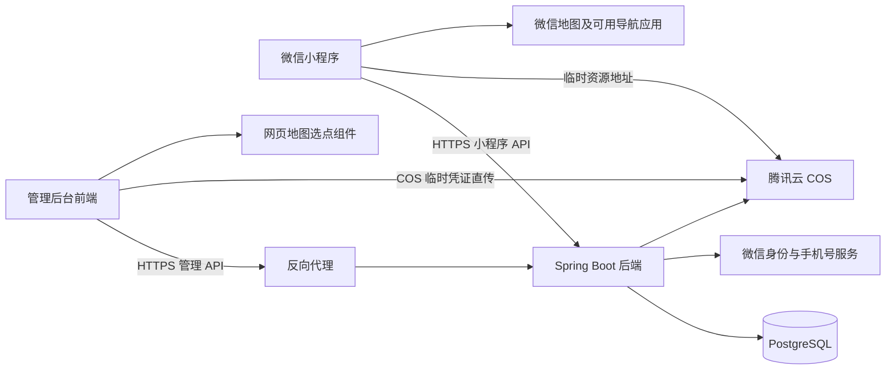

# 常清净文旅投｜技术设计文档

| 项目 | 内容 |
| --- | --- |
| 版本 | V1.0 技术方案初稿 |
| 日期 | 2026-09-08 |
| 关联需求 | [产品需求文档](product-requirements.md) |
| 实施计划 | [实现步骤与节点计划](implementation-roadmap.md) |
| 已确认技术方向 | 三工程分离；Taro + React + TypeScript；JDK 18 + Spring Boot 3.2.12；Spring Security；MyBatis-Plus；PostgreSQL；腾讯云 COS；Docker + Nginx |
| 本文范围 | 工程边界、技术选型建议、认证、接口、数据设计、媒体、地图、部署及验证 |
| 当前状态 | 设计文档，尚未创建应用工程、执行数据库迁移或部署服务 |

## 1. 架构决策

### 1.1 三个独立工程

| 工程 | 职责 | 构建与发布 |
| --- | --- | --- |
| `miniprogram` | 小程序页面、微信登录交互、产品浏览、视频与导航 | 独立依赖和构建，上传微信审核发布 |
| `backend` | 小程序 API、管理后台 API、认证、权限、内容发布、数据库和外部服务接入 | 独立 Java 工程，构建 JAR／容器部署 |
| `admin-web` | 网页管理后台：人员、注册用户、内容编辑、地图选点 | 独立依赖和构建，输出静态资源单独部署 |

**管理后台后端包含在 `backend` 中，通过独立的管理 API 和权限边界提供服务。**本版一个 Spring Boot 应用即可，同一后端同时服务两类客户端。前端通过 HTTP API 交互，不直接访问数据库，不由 Spring Boot 模板渲染页面。

建议先在当前仓库中设置三个独立目录，各自维护构建配置、依赖锁定、环境配置与流水线。工程分离不要求立即拆成三个 Git 仓库；以后如需分仓，不改变 API 契约。共享同一代码仓库或同一台服务器，也不影响三个工程独立发布。

### 1.2 系统关系



初期不引入微服务、服务注册中心、消息队列或 Kubernetes。Redis 不作为首版必需依赖；会话、微信接口凭据协调、浏览计数均可先使用 PostgreSQL。出现明确的负载瓶颈后再调整。

### 1.3 技术选型建议

| 层次 | 建议方案 | 说明 |
| --- | --- | --- |
| 小程序 | Taro + React + TypeScript | 已确认；编译成微信小程序代码后用微信开发者工具模拟、预览和真机调试 |
| 管理后台前端 | React + TypeScript + Vite | 独立 SPA；路由与表单组件选型在初始化时锁定 |
| 后台 UI 组件 | Ant Design，作为建议 | 用于表格、表单、上传和对话框；不用于小程序，不决定小程序视觉风格 |
| Java | JDK 18 | 已确认；构建和运行使用同一 Java 大版本；JDK 18 非 LTS，风险见本节下方 |
| Web 后端 | Spring Boot 3.2.12、Spring MVC、Bean Validation | Spring Boot 3.2.12 官方兼容 Java 17 至 23，因此可运行于 JDK 18 |
| 认证与权限 | Spring Security | 小程序 Bearer 认证与后台 Cookie 会话分别配置 |
| 数据访问 | MyBatis-Plus Boot 3 Starter + PostgreSQL JDBC | 常规 CRUD 使用 MyBatis-Plus；复杂发布事务、锁与 PostgreSQL SQL 使用显式 Mapper/XML，不强行套通用 CRUD |
| 数据库 | PostgreSQL | 用户已确认；使用受支持版本并锁定补丁版本 |
| 数据迁移 | Flyway | 管理结构及必要初始化数据，部署时单独执行 |
| 后台会话 | Spring Session JDBC | 会话持久化到 PostgreSQL，不依赖单机内存 |
| API 契约 | OpenAPI | 维护两类客户端可调用的接口及 DTO，可生成 TypeScript 类型 |
| 媒体 | 腾讯云 COS | 服务端使用 COS Java SDK 和临时密钥服务，管理网页使用短期凭证直传 |
| 地图 | 腾讯位置服务网页地图方案，作为建议 | 后台选点采用 GCJ-02，与微信地图对接；具体 SDK／组件需验证 |
| 运行部署 | Docker Compose + Nginx + Certbot | 一个业务域名按路径分流；自动续签证书；提供统一部署脚本 |

Taro 本身使用 MIT 开源许可证，不需要购买会员或支付框架使用费。开发时运行微信端监听构建，再把构建结果导入微信开发者工具，即可使用模拟器、Console、Network、预览和真机调试。可能产生费用的是微信认证／手机号能力、腾讯云服务器、COS 存储与流量、域名等外部服务。

JDK 18 是已确认约束，但它不是 LTS 版本，现已停止公开更新；Spring Boot 3.2.x 也已不是当前主线。Spring Boot 3.2.12 的官方系统要求是至少 Java 17、兼容至 Java 23，因此技术上可与 JDK 18 搭配。项目先按该组合锁定，部署前需把升级到受支持的 LTS JDK 21 及当前受支持 Spring Boot 版本作为一次明确评估；未经用户确认不擅自更换。初始化时还要锁定兼容的 MyBatis-Plus Boot 3 starter、Flyway、Taro、React 与 Node.js 版本，并提交前端锁文件和 Maven Wrapper。

## 2. 工程与模块组织

建议结构；下列目录尚未创建：

```text
changqingjing/
├── miniprogram/
│   ├── src/pages/           # 首页、会员专区、产品、合作权益、个人中心、登录
│   ├── src/components/      # 小程序组件
│   ├── src/services/        # 小程序 API 客户端
│   ├── src/auth/            # 登录状态、恢复、页面访问控制
│   └── package.json
├── backend/
│   ├── src/main/java/.../
│   │   ├── auth/            # 小程序与后台认证，分开实现
│   │   ├── staff/           # 后台人员与权限
│   │   ├── user/            # 注册用户
│   │   ├── content/         # 首页、景区、产品、合作权益与发布
│   │   ├── media/           # 上传、校验、资源访问和清理
│   │   ├── map/             # 地点数据校验、选点确认
│   │   ├── integration/     # 微信与对象存储适配
│   │   └── common/          # 错误响应、日志、时间等少量共用能力
│   ├── src/main/resources/db/migration/
│   ├── src/test/
│   └── pom.xml
├── admin-web/
│   ├── src/pages/           # 登录、内容、用户、人员管理
│   ├── src/components/      # 表单、图文编辑器、地图选点等
│   ├── src/services/        # 管理 API 客户端
│   └── package.json
├── contracts/              # OpenAPI 契约与生成说明
├── deploy/                 # 容器、反向代理、环境示例
└── docs/
```

后端业务模块内部区分 Controller、应用服务、数据访问和 DTO。小程序 Controller 与管理 Controller 使用独立 DTO，复用业务服务和持久化逻辑；数据库实体、密码字段、手机号密文、会话信息不能直接序列化给前端。

两个前端可以共享生成的接口类型，不能直接共享依赖 DOM 的组件。建议以 `contracts/openapi.yaml` 作为评审后的契约来源，由它生成客户端类型，并通过契约测试检查服务端实现；不要分别手写三份相互漂移的字段定义。变更契约时更新受影响的客户端；前端锁文件分别维护，后端依赖由 Maven 管理。

## 3. 网络与接口约定

### 3.1 单域名地址与边界

只有一个业务域名完全可行，不需要 `admin.example.com` 和 `api.example.com` 两个子域名。Nginx 在同一个 HTTPS 主机上按路径分流；以下以 `https://example.com` 为占位，部署时替换为用户提供的真实域名：

| 入口 | 示例 | 用途 |
| --- | --- | --- |
| 管理后台网页 | `https://example.com/admin/` | Nginx 返回独立构建的管理后台静态资源 |
| 小程序 API | `https://example.com/api/v1/app/` | Nginx 转发到 Spring Boot 小程序 API |
| 管理 API | `https://example.com/api/v1/admin/` | Nginx 转发到 Spring Boot 管理 API |
| 健康检查 | 仅内网／本机路径 | 供部署脚本判断后端是否就绪，不公开详细诊断信息 |
| 媒体 | 腾讯云 COS HTTPS 地址 | 图片与视频；不需要再购买一个自有业务域名 |

管理后台网页与管理 API 同源，Cookie 和 CSRF 处理更简单。单域名不会破坏三个工程的分离：管理前端仍独立构建，后端仍独立部署，小程序仍由微信发布，只是它们共用一个公网入口。代理只负责静态资源和转发，不承载业务；后端仍必须独立鉴权，不依赖路径或 Nginx 作为唯一权限控制。

COS 会使用腾讯云提供的 HTTPS 访问域名，因此网络上仍会访问一个 COS 服务域名，但这不是要求用户再注册一个业务域名。管理后台直传需要配置 COS CORS；小程序展示或下载资源时，要把实际 COS 域名加入微信后台对应的合法域名列表。若将来要求所有流量都只能出现自有域名，可以通过 Nginx 代理 COS，但会增加服务器出口流量、视频压力和成本，第一版不采用。

开发时用 Vite 开发代理转发管理 API。正式后台必须配置 Vite 的 base 为 `/admin/`，Nginx 对 `/admin/*` 使用 SPA fallback 到管理前端的 `index.html`，同时确保 `/api/*` 不进入该 fallback。确需跨域时，后端只允许配置中的精确 Origin，携带 Cookie 的请求不使用通配 Origin。小程序请求限制按微信合法域名、HTTPS 和媒体访问要求配置，与浏览器 CORS 分别处理。

### 3.2 API 风格

- 使用 `/api/v1/app/**` 与 `/api/v1/admin/**`，明确客户端边界。
- JSON 字段使用 `camelCase`；数据库使用 `snake_case`。
- 业务主键采用 UUID，API 作为字符串返回，避免 JavaScript 大整数精度问题。
- 时间存储为 `timestamptz`，接口输出带时区的 ISO 8601；前端按上海时区展示业务时间。
- 分页建议 `page=1&pageSize=20`，服务端限制 `pageSize <= 100`；使用稳定排序，例如 `sortOrder ASC, id ASC`。
- 成功响应含 `data`；错误响应含稳定业务错误码、可展示消息与 `traceId`。HTTP 状态码同时表达成功与失败，不把所有错误都包装成 HTTP 200。
- 参数校验返回 400，未认证 401，无权限 403，不可见／不存在内容 404，版本冲突 409，限流 429，外部服务暂不可用 503。
- `traceId` 不包含手机号或微信凭据。用户响应不返回内部堆栈、SQL 或第三方原始凭证。

示例：

```json
{
  "data": {
    "items": [],
    "page": 1,
    "pageSize": 20,
    "total": 0
  },
  "traceId": "request-trace-id"
}
```

```json
{
  "code": "AUTH_REQUIRED",
  "message": "请先登录",
  "traceId": "request-trace-id"
}
```

图文、上传和定位字段使用明确的结构校验；请求体、文字长度、图片数量和文件大小设上限，具体值在真实素材确定后锁定并展示给运营人员。

## 4. 两类认证与权限

### 4.1 小程序：微信身份 + 手机号首次授权

提供两个不同目的的认证接口：

| 接口 | 输入 | 行为 |
| --- | --- | --- |
| `POST /app/auth/wechat/session` | 新的 `loginCode` | 验证微信身份，只恢复已注册账号会话；不存在时返回 `REGISTRATION_REQUIRED`，不自动注册 |
| `POST /app/auth/wechat/register-login` | 新的 `loginCode`、用户授权取得的 `phoneCode` | 后端分别验证身份和手机号，创建或登录账号 |
| `POST /app/auth/logout` | 当前 Bearer token | 撤销当前小程序会话，客户端同时清理本地 token 和用户资料 |

表中省略公共前缀 `/api/v1`。`loginCode` 和 `phoneCode` 作用不同，均由服务端与微信交互验证；不接受客户端自行提交的 openid 或明文手机号作为认证依据。AppID、AppSecret 固定在服务端配置中，不由客户端指定。

首次注册：

1. 用户在会员福利入口或个人中心主动点击登录，并同意手机号授权。
2. 客户端获取当前有效微信登录凭证及手机号授权凭证，提交注册登录接口。
3. 后端在数据库事务外调用微信接口，取得可信身份与手机号，避免外部网络调用长期占用事务锁。
4. 在短事务内检查身份关联；首次创建用户、绑定微信身份及手机号，已有用户则验证关联后进入原账号。
5. 建立业务会话，返回业务 token 及脱敏用户资料，不下发微信会话密钥。

重复请求不能重复注册，依靠微信身份的数据库唯一约束保证。手机号冲突暂按“拒绝自动合并”处理，具体账号关联政策仍待产品确认。

一次性 code 不进入普通自动重试逻辑。结果未知时先用新的微信登录 code 尝试恢复已创建账号；确需再次授权时重新取得凭证。手机号授权已消耗且事务未完成时，提示重新授权，不伪造成功结果。

### 4.2 小程序会话与自动恢复

首版建议使用**服务端保存状态的随机 Bearer token**，不必为此引入 JWT 与刷新 token 体系。

- token 使用密码学安全随机数生成，客户端放在小程序本地存储，后续通过 `Authorization: Bearer ...` 发送。
- 服务端只保存 token 摘要、所属用户、到期时间和撤销状态，数据库中不保存可直接使用的原 token。
- 建议会话固定有效期 7 天，作为可配置初值；到期通过新的 `wx.login` 身份验证恢复已注册用户，无需正常情况下反复获取手机号。
- 首次游客打开首页不自动注册，也不因恢复失败弹出登录；会员专区入口本身不拦截。
- 产品列表、分类、搜索、详情统一要求有效会话，路由访问控制与服务端权限同时生效。
- 同时出现多个 401 时，客户端合并为一次恢复流程；恢复后最多重放一次可安全重试的读取请求，写入请求不自动重放。
- 恢复失败才在受保护入口显示登录；用户取消或拒绝授权统一切换到首页并清理待跳转目标。
- 个人中心登录成功保留当前页面；直接访问产品详情时登录成功恢复原详情；返回目标仅允许应用内部白名单路径。
- 个人中心提供主动退出入口。用户确认后先撤销当前服务端会话，再清理本地 token 和用户资料；即使网络异常，也允许清理当前设备的本地登录状态。

会话读取首版访问 PostgreSQL，后台清理过期记录。需要扩容时可以优化会话存储，不能先用每台服务器各自内存作为唯一会话来源。

### 4.3 管理后台：独立 Cookie 会话

- 使用 Spring Security 账号密码认证，密码只保存自适应哈希，例如 BCrypt，不保存明文或可逆密码。
- 使用 Spring Session JDBC 持久化后台会话；Cookie 为 Host-only、`HttpOnly`、生产 `Secure`、`SameSite=Lax`。
- 建议闲置 30 分钟失效，并设置最长 12 小时会话有效期；具体值可配置。
- 管理路径使用 CSRF 防护：前端先获取 CSRF token，写入请求通过约定请求头提交；登录成功／退出后重新获取 token。不能因为使用 JSON 就关闭 Cookie 认证的 CSRF 防护。
- 登录成功轮换会话标识；停用账号、重置密码及角色变更撤销对应会话，后续请求再次检查人员有效状态。
- 后台登录页面不提供公众自助注册。首个管理员由一次性初始化命令创建，密码从交互或受保护的临时配置输入，不提交默认密码。

小程序 Bearer 认证链不使用后台 Cookie；管理 API 不能接受小程序 token。Spring Security 按路径配置不同认证链，其他未明确开放的接口默认拒绝。

### 4.4 后台权限

初始按产品稿建议设置 `ADMIN`、`OPERATOR` 两种角色，映射到少量固定权限：

| 权限 | 管理员 | 运营 |
| --- | --- | --- |
| `content:read/write/publish` | 是 | 是 |
| `media:write`、地图选点 | 是 | 是 |
| `user:read` | 是 | 默认否 |
| `staff:manage` | 是 | 否 |

角色规则属于待产品定稿项，不建设自定义权限编辑器。控制器／服务端做权限检查，前端仅根据权限调整菜单。所有可能影响最后一个有效管理员的修改，在事务内通过同一锁串行校验，防止两个并发操作同时移除最后管理员。

### 4.5 微信服务端凭据

微信服务端接口所需的 access token 与本系统用户 token 完全分开。通过适配服务按有效期提前刷新，首版把加密后的接口凭据及到期时间保存在 PostgreSQL；多实例使用数据库锁协调刷新。遇到明确的接口凭据失效响应时刷新凭据；仅在能够确定业务 code 未被消费的情况下有限重试，结果未知时按第 4.1 节重新取得凭证。

应用日志不记录 AppSecret、登录 code、手机号授权 code、完整手机号、Cookie 或 Bearer token。

## 5. PostgreSQL 数据设计

### 5.1 基础约定

- 主键由 Java 生成 UUID，不要求额外安装 UUID 扩展。
- 使用 PostgreSQL 外键、唯一约束、CHECK 约束和事务保证数据一致性，不能只依赖前端校验。
- 所有时间采用 `timestamptz`，应用连接与服务端默认 UTC，展示层转换时区。
- 地图经度建议 `numeric(10,7)`、纬度 `numeric(9,7)`，分别限制在 `[-180,180]`、`[-90,90]`；坐标体系首版固定 `GCJ02`。
- 图文内容和类型特有的结构使用 JSONB；身份、状态、时间、分类引用、排序、坐标等需要查询或约束的字段使用普通列。
- 当前只需保存地点和导航，不涉及附近搜索、空间范围计算，首版不安装 PostGIS。
- 不创建订单、钱包、功德流水、付费会员或推荐奖励表。后续如引入金额，应独立设计精确数值与流水，不使用浮点数存储金额。

### 5.2 用户与认证表

| 表 | 主要字段 | 关键约束 |
| --- | --- | --- |
| `app_user` | `id`、显示昵称、头像资源 ID、状态、注册时间、最近登录时间 | UUID 主键；会员号未定义，不直接当作已确认业务字段 |
| `wechat_identity` | `user_id`、`app_id`、`openid`、可选 `unionid` | `UNIQUE(app_id, openid)`；首版不依赖一定存在的 unionid |
| `user_phone` | `user_id`、手机号密文、查询摘要、脱敏显示值、加密密钥版本、绑定时间 | 每用户一条绑定；手机号跨账号唯一策略待确认 |
| `app_session` | token 摘要、`user_id`、创建／到期时间、撤销时间 | token 摘要唯一；索引支持用户会话撤销与过期清理 |
| `admin_account` | 账号、密码哈希、显示姓名、角色、状态、时间字段 | 规范化后的登录账号唯一 |
| Spring Session JDBC 表 | 会话及属性 | 使用所选 Spring Session 版本的 PostgreSQL schema，由迁移工具管理 |
| `wechat_api_credential` | 服务配置标识、凭据密文、到期时间、刷新状态 | 每个服务配置一条，不与个人登录 token 混用 |

手机号采用带认证的加密方式存储，查询使用规范化号码的带密钥 HMAC 摘要，不能以普通 SHA 哈希代替防枚举保护。密钥在服务端秘密配置中，脱敏值用于列表。完整手机号查询只能由授权接口处理，不直接暴露密文或查询摘要。

在手机号跨账号规则定稿前，采用保守方案：发现其他微信身份已关联同一号码时，不自动合并或覆盖。若最终采用一号一账号，必须增加查询摘要的唯一约束；若允许共享手机号，则只约束微信身份唯一，并明确绑定策略。该迁移需要在注册功能实现前确定。

### 5.3 内容及版本模型

首页视频、公司介绍、景区、福利产品、产品分类、合作权益统一使用内容条目和不可变版本，减少重复发布逻辑，但每种内容仍有明确的服务端 DTO、校验规则和后台表单。

| 表 | 主要字段／用途 |
| --- | --- |
| `content_entry` | `id`、`kind`、可选唯一业务键、`draft_revision_id`、`published_revision_id`、`visibility`、`lock_version`、首次发布时间、创建／更新人和时间 |
| `content_revision` | `id`、`entry_id`、版本序号、结构版本、标题、简介、封面 ID、分类条目 ID、排序、经纬度、类型 payload、创建人和时间 |
| `content_revision_media` | `revision_id`、`media_id`、用途和顺序，用于完整追踪版本引用的资源 |
| `media_asset` | 对象 key、文件名、类型、大小、校验状态、资源用途、上传者及时间 |
| `scenic_stats` | 景区条目 ID、浏览次数 |
| `scenic_view_receipt` | 景区条目 ID、单次访问 ID、接收时间，用于短期去重 |
| `admin_audit_event` | 操作人、操作类型、目标 ID、结果、时间、traceId；记录发布、下架、人员变更等关键事件 |

`kind` 固定为 `HOME_VIDEO`、`COMPANY`、`SCENIC`、`PRODUCT`、`PRODUCT_CATEGORY`、`COOPERATION`。公司介绍和合作权益通过业务键保证各只有一个当前页面；首页视频允许保存多条内容记录，但发布事务保证首页同一时间最多只有一条可见记录。分类也走版本与发布流程，避免统一草稿规则只对部分内容生效。

普通列与 payload 分工：

| 内容类型 | 普通列 | JSONB payload 示例 |
| --- | --- | --- |
| 景区 | 标题、简介、封面、排序、经纬度 | 图文块、开放状态、地图原名、详细地址、自定义展示名称、是否自定义 |
| 产品 | 标题、简介、封面、分类条目 ID、排序 | 详情图、有序图文块、可选规格 |
| 分类 | 标题、排序 | 必要的展示配置 |
| 首页视频 | 标题、封面 | 视频资源 ID、展示开关 |
| 公司介绍 | 标题、简介、封面 | 可排序业务板块；板块内含正文和图片 |
| 合作权益 | 标题、简介 | 收益板块列表、合作价值图文块 |

媒体 ID 无论在列还是 payload 中，都同时提取到 `content_revision_media`，由服务端解析并校验，不能由客户端声明“无引用”绕过文件保护。地图名称、地址、坐标与正文属于同一版本，草稿改名不会提前改变已发布地点。

### 5.4 约束与索引

- `content_revision` 对 `(entry_id, revision_no)` 唯一；增加 `(entry_id, id)` 唯一键供复合外键引用。
- 内容条目的两个版本指针通过 `(id, revision_id)` 复合外键指向本条目的版本，防止把产品 A 指向产品 B 的版本。新建条目时指针允许为空。
- `visibility = PUBLISHED` 时必须有已发布版本；`kind` 不允许创建后随意变更。
- 产品分类引用必须指向分类类型；普通外键保证条目存在，类型约束由服务端在事务内校验。
- 版本记录保存后不原地修改，新增草稿产生新版本；`lock_version` 用于并发编辑检查。
- 小程序内容查询先过滤条目类型及可见状态，再读取已发布版本，不读取最新草稿。
- 对条目类型与可见状态、用户注册时间、身份唯一键、会话到期时间建立索引。产品按已发布标题搜索，参数化使用 `ILIKE`；数据量增长后根据执行计划考虑 `pg_trgm` 索引。
- JSONB 不默认给所有字段建立 GIN 索引；只有出现实际查询需求再增加。

### 5.5 草稿、发布与下架事务

保存草稿：校验输入 → 插入不可变版本及资源引用 → 按客户端的 `expectedVersion` 更新草稿指针和锁版本。版本不匹配则整体回滚并返回 409，提示重新加载，不能覆盖其他人刚保存的内容。

发布：

1. 开启事务，锁定内容条目并检查 `expectedVersion`。
2. 确认待发布版本仍为目标草稿，验证类型、必填项、资源 READY 状态和分类引用；景区配置了地图位置时再校验位置数据完整性。
3. 把 `published_revision_id` 指向该版本，设可见状态为 PUBLISHED；首次发布时设置首次发布时间。
4. 记录发布审计并提交；提交成功才向客户端报告成功。

下架：在事务内设置不可见并记录审计，保留已发布版本指针便于后台核对。小程序始终检查条目可见状态，旧链接返回 404。重新上架仍走发布校验。发布首页视频时先锁定该内容类型，并在同一事务下架其他已发布首页视频，避免并发产生两条首页视频。

分类下架仅隐藏分类入口，其已上架产品仍可在“全部”查看；有效分类筛选只接受已发布分类。产品可不选分类；选择的分类至少应已发布过，不能误挂到未完成的分类草稿。

首版动态内容 API 不使用共享响应缓存，避免跨用户泄漏产品数据或下架后继续返回旧内容。客户端恢复页面时刷新展示状态；已打开的页面不会被后台实时推送强制清空。媒体临时链接的到期限制见第 7 节。

### 5.6 数据迁移与并发

- 所有结构变更使用 Flyway 版本文件；生产不使用自动建表／自动改表功能。
- 使用迁移专用数据库账号执行结构变更，应用运行账号仅拥有必要的数据读写权限。
- Spring Session 的建表脚本纳入版本迁移，生产关闭框架重复自动初始化。
- 默认事务隔离级别可用 READ COMMITTED，注册依靠唯一约束，发布使用行锁／版本检查；不要把整个应用升为 SERIALIZABLE 代替局部并发设计。
- 发布期间采用兼容迁移：先加新字段、部署兼容代码、完成迁移，确认旧代码不再使用后才删除旧字段。

## 6. 主要 API 清单

以下省略 `/api/v1` 前缀，是接口设计草案；实际 DTO 与错误码在 OpenAPI 中细化，不代表接口已实现。

### 6.1 小程序 API

| 方法与路径 | 权限 | 用途 |
| --- | --- | --- |
| `GET /app/home` | 公开 | 已发布的视频、公司介绍摘要、景区入口 |
| `GET /app/company` | 公开 | 公司介绍详情 |
| `GET /app/scenics` | 公开 | 已发布景区分页列表 |
| `GET /app/scenics/{id}` | 公开 | 景区正文、状态、展示名称、地址、目的地坐标 |
| `POST /app/scenics/{id}/views` | 公开，限流 | 详情成功展示后提交单次访问 ID |
| `GET /app/cooperation` | 公开 | 已发布的收益板块和合作价值 |
| `POST /app/auth/wechat/session` | 公开认证入口，限流 | 仅恢复已注册用户登录 |
| `POST /app/auth/wechat/register-login` | 公开认证入口，限流 | 手机号授权注册／登录 |
| `GET /app/me` | 注册用户 | 本人脱敏资料，不接受任意用户 ID |
| `GET /app/product-categories` | 注册用户 | 已发布分类 |
| `GET /app/products` | 注册用户 | 关键词、分类及分页查询 |
| `GET /app/products/{id}` | 注册用户 | 已上架产品详情 |

福利查询统一在服务端认证，未登录时不返回产品正文。会员空间等暂未开放功能不提供空的交易或会员业务接口。

浏览计数：前端每次独立打开详情产生一个 `viewId`，成功加载后上报，同一次打开内重试复用该 ID。服务端同一事务内插入去重记录并仅在插入成功时原子增加计数。后台预览不调用此接口。去重窗口建议 24 小时，客户端超过窗口不补发；服务端限流，明确其为浏览次数而非独立访客或防作弊指标。

### 6.2 管理 API

注册用户冻结／解冻复用 `DISABLED`／`ACTIVE` 状态，并清除该用户的所有会话。状态管理、删除、已有账号登录和资料修改使用同一用户行锁，避免冻结／删除与重新登录并发造成失效凭据恢复。写操作携带当前版本，版本变化返回 409，后台刷新后需再次确认。

删除采用保留最小删除记录的方式：`deleted_at` 非空、状态 `DISABLED`，清空昵称、头像关联及资料完善标记，删除手机号、微信身份和会话；列表和本人资料查询排除删除记录。非业务引用的自有头像进入现有媒体清理队列，保留对象 Key 元数据直到 COS 删除成功；其他用户／业务引用的媒体不删除。操作审计仅记录管理员、目标 ID 和状态，不保存昵称、手机号或微信身份凭证。既有安全备份按原保留策略处理，不在删除操作中改写。

| 方法与路径 | 权限 | 用途 |
| --- | --- | --- |
| `GET /admin/auth/csrf` | 认证准备 | 初始化或更新 CSRF token |
| `POST /admin/auth/login` | 认证入口、CSRF、限流 | 工作人员账号密码登录 |
| `GET /admin/auth/me` | 后台会话 | 当前人员和权限 |
| `POST /admin/auth/logout` | 后台会话、CSRF | 销毁会话 |
| `GET /admin/staff` | `staff:manage` | 后台人员查询 |
| `POST /admin/staff` | `staff:manage` | 创建工作人员 |
| `PATCH /admin/staff/{id}` | `staff:manage` | 姓名、角色、状态修改 |
| `POST /admin/staff/{id}/reset-password` | `staff:manage` | 重置密码并撤销会话 |
| `GET /admin/users`、`GET /admin/users/{id}` | `user:read` | 注册用户列表、详情 |
| `PATCH /admin/users/{id}/status` | `user:manage`，仅 ADMIN、CSRF | `ACTIVE` / `DISABLED`，携带 `expectedVersion`；冻结／解冻并清除旧会话 |
| `DELETE /admin/users/{id}?expectedVersion=...` | `user:manage`，仅 ADMIN、CSRF | 删除个人资料及绑定，清除会话，允许以后重新注册 |
| `GET /admin/contents?kind=...` | `content:read` | 各类内容列表 |
| `POST /admin/contents` | `content:write` | 创建类型明确的内容条目 |
| `GET /admin/contents/{id}` | `content:read` | 编辑数据、草稿和当前发布信息 |
| `PUT /admin/contents/{id}/draft` | `content:write` | 按类型保存新草稿，携带 `expectedVersion` |
| `GET /admin/contents/{id}/preview` | `content:read` | 仅后台可读的草稿预览 |
| `POST /admin/contents/{id}/publish` | `content:publish` | 发布／上架，携带 `expectedVersion` |
| `POST /admin/contents/{id}/unpublish` | `content:publish` | 下架，携带 `expectedVersion` |
| `POST /admin/media/uploads` | `media:write` | 创建受限上传任务 |
| `POST /admin/media/uploads/{id}/complete` | `media:write` | 通知上传结束，由服务端复核 |
| `GET /admin/media/{id}` | `content:read` | 查询资源处理状态及受限预览地址 |
| `POST /admin/map-selections` | `content:write` | 确认选点并返回短期签名的选点结果 |

所有后台写入请求均需后台 Cookie 会话、CSRF 校验及对应权限，不能因为表中未逐项写 CSRF 就省略。内容类型固定并由服务端验证，不接受客户端通过任意 `kind` 或 payload 创建新业务。

若工作人员正在修改的内容已被他人更新，返回 `CONTENT_VERSION_CONFLICT`；待发布资源未完成验证返回 `MEDIA_NOT_READY`；身份手机号冲突返回独立错误码，不返回另一账号的资料。

## 7. 图片、视频与图文内容

### 7.1 文件与数据库分开

图片、视频文件存放腾讯云 COS，PostgreSQL 只保存资源元数据、COS Object Key 与内容引用。数据库不保存大文件二进制，容器临时磁盘不作为正式媒体存储。

默认使用私有 COS 存储桶。运营上传的草稿资源不能通过长期公开 URL 提前泄漏；预览接口要求后台身份，已发布内容按调用方权限返回有时效的 COS 签名资源地址。

公开首页和景区可以匿名取得对应已发布资源地址；产品资源地址随已认证的产品接口返回。签名 URL 在有效期内可能被转发，不宣称是内容防复制机制；同一资源若同时用于公开内容，本身也不能再视为产品私有素材。

### 7.2 上传流程

```text
后台前端申请上传任务
    → 后端检查人员权限，生成随机对象 key 和短期上传凭证
    → 浏览器直接上传到腾讯云 COS，展示进度
    → 浏览器通知上传完成
    → 后端复核实际对象并进行格式验证
    → 资源变为 READY，允许绑定到可发布内容
```

- 后端通过腾讯云临时密钥服务生成最小权限、短时有效的 COS 凭证，只允许写入指定 Object Key，不向浏览器下发永久 SecretId／SecretKey。
- COS CORS 精确允许唯一业务域名；上传请求不携带后端 Cookie，由临时凭证授权。
- 服务端使用 COS Java SDK 核对实际对象大小、ETag 与文件内容，不能只相信扩展名、浏览器 Content-Type 或客户端“完成”通知。
- 图片初期支持 JPEG、PNG、WebP；视频建议 MP4 容器、H.264 视频及兼容音轨，实际支持需真机验证。不兼容视频拒绝发布并给出原因，首版不默认建设转码平台。
- 完成校验较慢时采用 `VERIFYING` 状态，后台轮询结果；校验任务在后端运行，以数据库状态、处理租约和有限重试记录恢复，不只依赖会随进程退出丢失的内存任务。
- 状态流转为 `UPLOADING → VERIFYING → READY / FAILED`，发布事务只允许 READY 资源。
- 校验失败或替换失败不修改当前线上版本，已有文件保持可访问。

COS 签名地址初始有效期可设 15 分钟，并为视频长度留出余量；客户端遇到过期时重新获取已发布内容的资源地址。COS 访问需支持视频 Range 请求。实际 COS 域名加入所需微信合法域名配置。

下架后停止签发新链接，已发出的临时链接可能持续到期，已下载内容无法追回。这与业务 API 下架后立即拒绝新访问是两个不同边界。

### 7.3 清理与引用

已发布版本、当前草稿及保留版本的文件引用均由数据库追踪。新增版本与新增引用在同一事务提交。首版只清理超时上传、失败上传及超过宽限期的无引用资源；不自动删除历史版本引用的媒体。

清理任务先在数据库中锁定并标记资源为待删除，绑定操作只能引用 READY 资源，再调用 COS 删除并记录结果。不能先删除对象再检查是否刚被并发发布引用。

### 7.4 图文结构

采用受限的结构化内容块，例如段落、标题、图片、列表，不开放任意 HTML／脚本。图片以资源 ID 引用，前端收到接口时再解析成当前可用地址。

管理后台图文编辑器与小程序渲染器共享结构约定，保存 `schemaVersion`。服务端校验块类型、数量、长度、资源权限；网页渲染做文本转义，小程序也只渲染支持的节点。外链视频、任意 iframe、脚本和可执行样式不属于首版能力。

## 8. 地图选点与名称编辑

### 8.1 后台流程

- 后台地图组件支持搜索、选择地图地点、查看标记和详细地址，并回显已有坐标。
- 导航地点是景区的可选增强项；未配置地图 key 或未选点时，景区仍可保存和发布，小程序隐藏导航卡片。
- 优先选用 GCJ-02 数据源；接入其他坐标体系时必须在明确的适配层转换，不能把百度 BD-09 或 GPS WGS-84 直接当 GCJ-02 保存和导航。
- 浏览器地图 key 按供应商要求限制域名和能力；服务端专用 key 不进入前端构建。
- 若组件使用 iframe 消息通信，校验精确 `origin`、发送窗口、消息类型和数据结构，不接受任意 `postMessage`。
- 工作人员确认选点后，后端检查坐标范围及字段，返回绑定该人员与本次地点数据的短期签名结果；这是保存过程的完整性校验，不是对地点真实性的自动认证。

### 8.2 修改约束

景区保存接口区分两类输入：

| 操作 | 服务端处理 |
| --- | --- |
| 只改展示名称 | 复用当前版本的原始地图名称、详细地址、经纬度；只更新自定义展示字段 |
| 重新选点 | 提交有效选点确认结果，替换地图原始信息和坐标；已有自定义名保留并提示核对 |
| 取消选点 | 不提交新的选点结果，地点数据保持不变 |

普通草稿更新不能通过附带 `latitude`、`longitude` 字段绕过选点流程；地理数据只由地点子流程更新。前后端分别保留 `providerName`、`providerAddress`、`displayName`、`nameCustomized`，避免再次编辑时混淆原名和自定义名。

正式接口在景区配置了导航地点时返回目的地坐标及 `displayName`。小程序用该坐标调用 `wx.openLocation` 或 Taro 对应接口，`name` 传自定义展示名，`address` 传详细地址；不根据显示名称重新地理编码。未配置时这些字段为空且不渲染导航入口。

小程序只展示固定目的地时，不预先调用用户当前位置接口。导航软件选择交给微信与手机实际能力；iOS、Android 分别验证可选应用，不自行承诺任意应用直达或固定选择列表。

## 9. 两个前端的实现约定

### 9.1 小程序

- 路由分公开页面与需登录页面；首页和会员专区入口保持公开。
- `AuthService` 统一负责本地会话、单次自动恢复、用户主动登录和取消回首页；页面不各写一套微信授权逻辑。
- `ApiClient` 统一添加 Bearer token、解析错误和控制有限重试。图片加载、视频播放与接口失败分别处理。
- 登录目标保存在一次交互的内存状态中，取消清理；不能取消后又被后台请求自动弹回登录。
- 正在登录时发起的重复受保护请求合并等待；用户拒绝授权后终止此次等待，避免弹窗循环。
- 只保存必要的用户展示信息，不把手机号、会话密钥或完整正文写入日志。退出时清理会话和需要登录的缓存。
- 暂未开放入口使用明确的固定状态，点击“敬请期待”；不由后台配置执行动态代码来开放新能力。

### 9.2 管理后台前端

- 页面模块按运营业务拆为首页宣传视频、公司介绍、景区管理、会员福利管理、合作权益、注册用户和后台人员；不使用一个大表单混合多个模块。
- 会员福利默认进入福利产品列表，分类作为页面内的“福利分类设置”；合作权益保留收益板块、分公司方案和会员体系入口，后两者只显示“敬请期待”。
- 按权限展示路由和按钮，真正授权仍由后端完成。
- API 请求使用 Cookie 与 CSRF token；不把后台会话 token 放入 localStorage。
- 内容编辑表单携带 `expectedVersion`，409 时提示重新加载，不能静默覆盖。
- 草稿和已发布状态明确区分，预览不等于发布；运营人员能看到当前线上版本是否落后于草稿。
- 上传组件展示进度，并将内部媒体状态转换为“上传中、处理中、可使用、处理失败”等运营语言；资源未就绪时不可发布。
- 页面离开前检测未保存变更；地图弹窗取消不污染编辑表单中原有坐标。

## 10. 环境、部署与配置

### 10.1 环境隔离

| 环境 | 运行方式 | 数据与外部服务 |
| --- | --- | --- |
| 本地开发（macOS） | 三个工程分别启动；PostgreSQL 可用 Docker Compose | 独立开发库，微信 mock 仅用于开发；COS 可用开发前缀／开发桶，真实授权需测试账号联调 |
| 测试环境（腾讯云 Ubuntu） | 独立管理前端产物和后端容器 | 独立 PostgreSQL 数据库、COS 桶／前缀与测试 AppID，按实际账号条件配置 |
| 正式环境（腾讯云 Ubuntu） | 三个工程分别发布 | 正式 PostgreSQL、COS 和微信账号 |

测试与正式至少使用不同数据库和资源命名空间，账号权限相互隔离。配置中明确 AppID 与数据库环境的对应关系，不让测试自动登录写入正式用户表。

### 10.2 部署拓扑

初期部署到腾讯云 Ubuntu，一台服务器即可承载 Docker Compose 服务，但进程、镜像和产物保持分离：

```text
唯一业务域名（Nginx HTTPS）
├── /admin/*                      → admin-web 独立静态资源与 SPA fallback
├── /api/v1/admin/*               → backend 管理 API
├── /api/v1/app/*                 → backend 小程序 API
└── /.well-known/acme-challenge/* → Certbot ACME webroot

backend 容器 → PostgreSQL 私网连接
backend / 客户端 → 腾讯云 COS、微信与地图服务
```

管理后台静态资源不打入后端 JAR。后端新版本不要求重新构建管理前端，小程序新版本也不要求同步重启后端，前提是 API 保持兼容。PostgreSQL 首版可运行在 Compose 中并挂载持久卷，也可改用腾讯云托管数据库；数据库端口不对公网开放。

Compose 至少包含 `backend`、`postgres`、`nginx`。Certbot 通过容器执行签发／续签命令，共享 ACME challenge 和证书只读挂载目录；管理前端在构建阶段产出静态文件，由 Nginx 镜像或只读卷提供。各服务设置健康检查和日志轮转。

Nginx 路由的核心形式如下，最终配置在拿到真实域名后生成：

```nginx
location ^~ /api/v1/app/   { proxy_pass http://backend:8080; }
location ^~ /api/v1/admin/ { proxy_pass http://backend:8080; }
location ^~ /admin/        { try_files $uri $uri/ /admin/index.html; }
location ^~ /.well-known/acme-challenge/ { root /var/www/certbot; }
```

实现时补齐代理头、超时、上传大小、安全响应头与静态缓存；不能直接照抄片段作为完整生产配置。

### 10.3 配置归属

| 工程 | 公开配置示例 | 必须保密的配置 |
| --- | --- | --- |
| 小程序 | AppID、API 基址、环境名 | 不应含任何服务端密钥 |
| 管理前端 | `/api/v1/admin/` 相对路径、受限的网页地图 key | 不应含数据库密码、COS 永久密钥、AppSecret |
| 后端 | 端口、数据库地址、COS Region／Bucket、会话 TTL | 数据库密码、AppSecret、COS SecretId／SecretKey、手机号加密／查询密钥、选点签名密钥 |
| 数据迁移任务 | 数据库地址、迁移位置 | 迁移账号凭据，与运行账号分开 |

前端 `VITE_*` 等构建变量会进入公开产物，不能当作秘密配置。示例 `.env.example` 只写占位值，真实环境配置不提交仓库。生产启用 HTTPS Cookie，本地如需 HTTP 仅在开发 profile 关闭 Secure，并验证该设置不会进入生产。

### 10.4 一键部署、证书续签与恢复

统一入口为 `deploy/deploy.sh`，生产人员不需要逐个记忆 Docker 命令。域名、证书邮箱、COS、数据库和微信配置写入服务器上不进仓库的生产环境文件。脚本必须提供以下动作：

| 命令示意 | 作用 |
| --- | --- |
| `./deploy/deploy.sh bootstrap` | 首次检查 Ubuntu、Docker、域名解析和 80/443 端口，申请证书，启动全部服务并安装续签定时器 |
| `./deploy/deploy.sh deploy` | 构建／拉取镜像、执行数据库迁移、滚动更新服务、健康检查，失败时停止继续发布 |
| `./deploy/deploy.sh renew-cert` | 执行 `certbot renew`，续签成功后校验并 reload Nginx 容器 |
| `./deploy/deploy.sh status` | 查看容器、健康状态和当前证书到期信息 |

首次部署仍然只有一个入口，但需要用户在生产环境文件中提供真实域名、证书通知邮箱及必要密钥。脚本对缺失值明确报错，不猜测。数据库迁移先作为一次性 Compose job 成功退出，随后才更新后端。

Ubuntu 主机安装 systemd timer，定期调用 `deploy.sh renew-cert`；Certbot 使用 webroot 验证，不因续签暂时停止 Nginx。续签后执行 `nginx -t`，通过才 reload。定时任务失败写入日志并产生可见告警；不能只依赖“Certbot 会自动续签”的假设。证书目录持久化并只读挂载到 Nginx，禁止把证书提交仓库或烘焙进镜像。

常规发布顺序：

1. 验证数据库迁移与当前线上版本兼容，备份后先执行兼容迁移。
2. 部署后端镜像，检查健康状态、数据库连接与关键 API。
3. 部署管理前端静态资源，验证登录、CSRF、上传与内容发布。
4. 构建小程序，完成真机测试后上传、审核与发布。

后续只发布实际变化的工程。兼容性变更先支持新旧客户端，再发布客户端，观察后移除旧字段。部署脚本保留上一版后端镜像与管理前端产物标识，健康检查失败可回退应用版本；数据库迁移不自动执行破坏性的逆向脚本，必要时前向修复。

### 10.5 备份与监控

- PostgreSQL 至少每日自动备份到服务器之外，定期执行恢复演练；可根据恢复目标启用托管备份或 WAL 连续归档。具体 RPO／RTO 待运维需求明确。
- COS 启用适当的保留／版本策略；数据库恢复时需保证对应 Object Key 仍存在，不能只有数据库备份。
- 记录接口错误、认证失败、外部服务失败、上传校验失败和发布失败，日志含 traceId 并脱敏。
- Spring Boot 健康检查区分存活和就绪，只有准备就绪才接收流量。诊断和详细管理端点不对公众开放。
- 对登录、手机号授权、浏览计数和上传申请实施限流；首版可在单一反向代理集中限制，多代理扩容后再引入共享限流状态。

## 11. 开发验证计划

以下是实现阶段需要执行的验证，不代表本次编写文档已运行这些测试。

| 层次 | 验证重点 |
| --- | --- |
| 服务单元测试 | 类型校验、角色授权、只改展示名不改坐标、发布状态转换 |
| PostgreSQL 集成测试 | 使用真实 PostgreSQL（可由 Testcontainers 启动），验证 JSONB、唯一约束、版本指针、事务和并发；不用 H2 代替 |
| 认证集成测试 | 游客不注册、微信身份防重复、一次性凭据失败、会话恢复、手机号冲突、后台会话与小程序 token 不互通 |
| 权限测试 | 产品 API 未登录拒绝、运营无法读用户与人员管理、Cookie 写操作 CSRF 校验、停用／重置密码后会话失效 |
| 发布测试 | 草稿不影响线上、资源未 READY 不可发布、并发发布 409、下架旧链接不可查看、分类下架仍可在全部查看产品 |
| 媒体集成测试 | 直传凭证范围、真实文件校验、失败替换、过期地址刷新、清理任务不能删除仍被引用的文件 |
| 地图测试 | 选点确认／取消、坐标系、改名不重定位、重新选点回显、无效签名拒绝 |
| 管理后台端到端 | 登录 → 编辑内容 → 选点／上传 → 保存草稿 → 发布 → 小程序读取结果 |
| 真机验收 | 实际手机号授权、取消回首页、个人中心登录、导航应用选项、视频兼容、长文和安全区域 |

单测可用微信服务 mock 控制错误场景，但不能用 mock 通过来代替实际账号的手机号授权、媒体播放或地图导航验证。验收场景与产品文档 AC 编号对应维护。

接口契约先行：为页面提供确定的 DTO 和错误响应，前端可在开发环境使用 mock 并行实现；测试与正式必须明确关闭认证 mock，启动时校验配置组合。

## 12. 实施顺序与待定项

建议先建三个空工程与 PostgreSQL 迁移，再完成一个最小闭环：**后台登录 → 编辑公司介绍 → 保存并发布 → 小程序匿名读取**。该闭环即包含基本后台权限；随后完善人员管理、媒体、景区地图、微信注册登录和福利产品，最后完成所有真机验收。

| 决策 | 状态 |
| --- | --- |
| 三工程分离、后端包含管理 API | 已确认，本方案按三个独立构建与部署单元落实 |
| Spring Boot、PostgreSQL | 已确认 |
| 同仓库三个目录、单后端应用 | 本文建议，不额外拆管理后端服务 |
| 小程序 Taro + React + TypeScript | 已确认，可在微信开发者工具模拟器和真机调试；Taro 本身无需会员费 |
| JDK 18 + Spring Boot 3.2.12 | 已确认；兼容但均非当前长期支持基线，保留升级风险项 |
| Spring Security、MyBatis-Plus | 已确认；后台 Cookie 与小程序 Bearer 仍使用不同认证链 |
| 管理前端 React + TypeScript + Vite | 当前建议，待用户最终确认 |
| 具体依赖版本 | 初始化时核对官方支持情况，锁定兼容组合 |
| 运营权限、个人中心未定义字段 | 沿用产品待定项，不创建对应资金或会员业务 |
| 手机号跨微信身份绑定规则 | 注册数据迁移前确定；默认不自动合并 |
| 腾讯云 COS | 已确认；Bucket、Region、访问策略、额度与上传规格在接入前确定 |
| Docker Compose + Nginx + Certbot + 一键脚本 | 已确认；真实域名和服务器信息在部署时提供 |
| 地图 SDK／账号 | 接入前选择并做最小验证 |
| 服务器规格、备份恢复目标 | 根据预算、素材与预期访问量确定，不凭截图估算容量 |

## 13. 关联资料

- [产品需求文档](product-requirements.md)
- [开发、调试与发布指南](wechat-miniprogram-development-guide.md)
- [Spring Boot 3.2.12 系统要求](https://docs.spring.io/spring-boot/docs/3.2.12/reference/html/getting-started.html#getting-started.system-requirements)
- [Spring Security CSRF 文档](https://docs.spring.io/spring-security/reference/servlet/exploits/csrf.html)
- [Spring Session 文档](https://docs.spring.io/spring-session/reference/)
- [MyBatis-Plus 安装文档](https://baomidou.com/getting-started/install/)
- [腾讯云 COS 文档](https://cloud.tencent.com/document/product/436)
- [Certbot 文档](https://eff-certbot.readthedocs.io/)
- [PostgreSQL JSON 类型](https://www.postgresql.org/docs/current/datatype-json.html)
- [PostgreSQL 数据约束](https://www.postgresql.org/docs/current/ddl-constraints.html)
- [PostgreSQL 备份与恢复](https://www.postgresql.org/docs/current/backup.html)
- [Taro 开发文档](https://docs.taro.zone/docs/GETTING-STARTED)
- [Taro MIT 许可证](https://github.com/NervJS/taro/blob/main/LICENSE)
- [Taro 位置接口](https://docs.taro.zone/docs/apis/location/openLocation)

外部链接作为实施核对入口；本次检索失败的限制见第 1.3 节。产品业务以需求文档及后续确认结果为准，技术方案不自动扩大产品范围。
