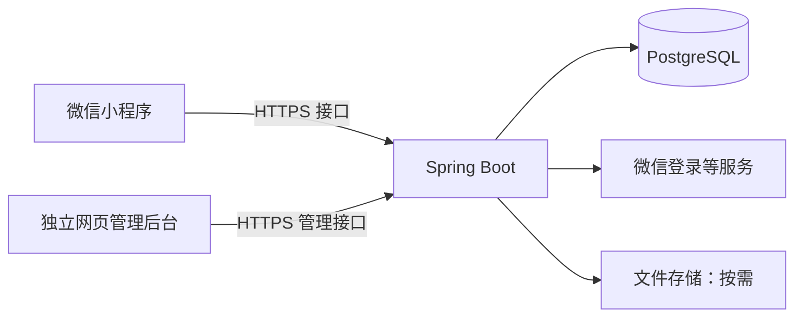

# 微信小程序开发、调试与发布指南

整理日期：2026-09-08

本文用于指导本项目从开发准备到正式上线。后端使用 JDK 18、Spring Boot、Spring Security 和 MyBatis-Plus，数据库采用 PostgreSQL；小程序、后端（含管理后台 API）、管理后台前端分为三个独立工程。小程序使用 Taro + React + TypeScript。具体架构见[技术设计文档](technical-design.md)。

## 1. 技术方案

### 1.1 前端如何选择

普通 React 网页项目不能直接上传成为微信小程序。使用 React 开发小程序时，可以通过 Taro 构建成小程序代码；依赖浏览器 DOM 的网页组件库通常不能直接使用。

| 对比项 | 微信原生小程序 | Taro + React + TypeScript |
| --- | --- | --- |
| 编写方式 | WXML + WXSS + JavaScript/TypeScript + JSON | React 组件 + TypeScript + 样式 + 配置 |
| 学习重点 | 小程序模板、组件、生命周期和 API | React，以及小程序平台规则和 Taro 构建流程 |
| 主要优点 | 直接使用微信能力，排查问题路径短 | 可以沿用 React 的组件和开发习惯 |
| 需要考虑 | 与网页 React 写法不同 | 多一层构建，需要确认第三方库兼容性 |
| 适用情况 | 只做微信端，前端从头学习 | 已熟悉 React，或未来考虑其他端 |

本项目已经选择 Taro + React + TypeScript。Taro 将源码编译成微信小程序代码，可以使用微信开发者工具的模拟器、调试器、预览和真机调试。多端支持仍需要分别适配和测试。

Taro 本身采用 MIT 开源许可证，不需要购买 Taro 会员或支付框架使用费。微信认证、手机号快速验证、腾讯云服务器、COS 存储及流量等平台能力可能收费，应分别按实际账号与用量核对。

### 1.2 整体架构



- 小程序前端代码上传到微信，由微信负责分发。
- Spring Boot、数据库和文件存储需要自行部署或使用托管服务。
- 不强制使用腾讯云，也不强制使用微信云开发。
- 本项目包含独立的网页管理后台，用于工作人员管理账号、查看注册用户并维护内容；当前不开发预约或订单业务。
- 初期使用单体 Spring Boot 应用即可；Redis、微服务、Kubernetes 等根据实际需求再引入。

## 2. 开发前准备

### 2.1 账号和权限

| 准备项 | 用途与说明 |
| --- | --- |
| 微信小程序账号 | 在微信公众平台注册，账号类型选择“小程序” |
| 账号主体 | 根据实际业务选择个人、企业等主体；公司业务建议使用公司主体 |
| 小程序 AppID | 创建项目和调用微信能力时使用 |
| 管理员 | 管理账号、配置、成员以及发布相关操作 |
| 开发者权限 | 由管理员添加开发人员，用于开发、调试、上传等操作 |
| 体验成员 | 用于发布前的体验版测试 |
| AppSecret | 后端调用相关微信接口时使用，只保存在服务端 |

涉及交易收款时，提前核对服务类目、主体资质、微信支付接入条件。小程序账号注册与支付能力开通需要分别处理，不能认为注册账号后就可以直接收款。

### 2.2 本地开发工具

| 工具 | 用途 |
| --- | --- |
| 微信开发者工具 | 模拟运行、调试、手机预览、上传代码 |
| JDK | 运行和构建 Java 后端；版本与选定的 Spring Boot 版本匹配 |
| IDEA 或其他 Java IDE | 编写、运行和断点调试后端 |
| Maven 或 Gradle | 后端依赖管理和构建 |
| 编辑器 | 编写小程序前端代码 |
| Node.js 和包管理器 | 使用 Taro 时需要，版本按所选 Taro 版本要求确定 |
| PostgreSQL | 保存业务数据，初期可以本地运行 |
| 接口调试工具 | 独立验证接口响应，帮助区分前端和后端问题 |

本项目锁定 JDK 18 与 Spring Boot 3.2.12。Spring Boot 3.2.12 支持 Java 17 至 23，因此可以使用 JDK 18；但 JDK 18 非 LTS 且已停止公开更新，正式长期运行前应单独评估升级到受支持的 LTS JDK。未经确认不直接更换已选版本。

### 2.3 上线资料和基础设施

- 小程序名称、头像、介绍、服务类目和业务所需资质。
- 小程序备案，以及账号后台要求的认证。
- 腾讯云 Ubuntu 服务器、唯一业务域名、HTTPS 证书。
- 腾讯云 COS Bucket、Region、访问凭据和访问策略。
- 后端网站／域名所需的 ICP 备案。
- 隐私保护指引，以及实际使用个人信息所需的授权交互。
- 涉及支付等能力时，对应的账号、配置和资质。

**小程序备案与后端网站／域名的 ICP 备案需要分别处理，不能认为完成一个就覆盖另一个。**小程序通过平台办理，后端域名按接入服务商要求办理。已有备案信息能否复用，以实际办理流程为准。

备案和资料准备建议与代码开发同步推进。认证要求、费用、类目资质和审核时效以账号后台及主管部门当前规则为准，不在本文固定承诺。

## 3. 开发顺序

### 3.1 先定义第一版范围

先明确用户是谁，以及用户需要完成的一条核心业务流程。本项目可以先完成：后台发布景区介绍 → 用户从首页查看详情 → 打开景区导航。

第一版优先完成这条流程，再扩展其他页面和功能。

### 3.2 打通前后端和数据库

第一个开发目标：

```text
打开小程序 → 请求 Spring Boot → 查询数据库 → 页面显示结果
```

建议后端初期具备：

- 用户登录和身份校验。
- 业务列表、详情、提交等接口。
- 数据库访问。
- 参数校验、统一错误响应和日志。

建议前端初期具备：

- 页面路由和基础布局。
- 统一的接口请求封装。
- 开发、测试、正式环境的接口地址配置。
- 登录状态管理。
- 加载中、空数据、请求失败等状态提示。

### 3.3 创建并运行前端

原生方案：在微信开发者工具中创建小程序项目，填写 AppID，选择合适模板，直接开发页面、样式、逻辑和配置。

Taro 方案：使用 Taro 脚手架创建项目，选择 React 和 TypeScript，安装项目依赖。生成项目包含相应脚本时，在前端项目目录运行：

```bash
npm run dev:weapp
```

然后用微信开发者工具导入项目，检查 `project.config.json` 中的 AppID，以及 `miniprogramRoot` 是否指向实际构建输出目录。

编辑 Taro 源码后，由 Taro 重新构建，再在开发者工具中查看效果。不要直接修改构建产物目录中的业务代码，否则下一次构建会覆盖修改。

本文中的命令用于后续项目初始化后的操作说明；当前文档本身不会创建前端工程或这些脚本。

### 3.4 实现微信登录

典型流程如下；使用 Taro 时可调用对应的 Taro 登录 API：

```text
用户在指定入口主动登录，并同意手机号授权
    ↓
小程序取得 wx.login 的临时 code 和手机号授权 code，发给 Spring Boot
    ↓
Spring Boot 分别验证微信身份和手机号凭证
    ↓
根据可信身份查找或创建业务用户，并绑定手机号
    ↓
后端签发自己的登录 token，并返回给小程序
    ↓
小程序后续调用业务接口时携带 token
```

- AppSecret 和 session_key 只保存在服务端，不写入前端代码或下发给客户端。
- 后端根据校验后的登录态识别用户，不直接相信客户端提交的用户 ID。
- 微信登录不等于自动获取手机号、昵称和头像，这些信息按业务需要单独处理。
- 登录 token 需要有过期和重新登录的处理。
- 首页不要求登录；福利入口和个人中心支持主动登录。取消或拒绝授权返回首页，后续恢复已有账号时通常不重复要求手机号授权，详见产品与技术文档。

## 4. 开发调试

### 4.1 电脑本地联调

1. 启动本地数据库。
2. 在 IDEA 中以 Debug 模式启动 Spring Boot，例如监听 `8080` 端口。
3. 用接口工具确认后端接口可以正常访问。
4. 把小程序开发环境的接口地址设为 `http://localhost:8080`。
5. 微信开发者工具中临时启用“不校验合法域名、TLS 版本以及 HTTPS 证书”相关设置。
6. 在开发者工具里运行小程序，查看 Console 和 Network。
7. 在后端打断点，检查请求参数、登录态、数据库查询和返回结果。

跳过域名和证书校验只用于开发调试。上线前必须使用正常校验条件验证请求。

### 4.2 手机预览与真机调试

在微信开发者工具中使用“预览”或“真机调试”，通过微信扫码运行。预览用于查看实际体验，真机调试用于进一步定位手机运行时的问题。

**手机上的 localhost 指手机自己，不是开发电脑。**

手机访问本地 Spring Boot 时，可以尝试：

1. 手机和电脑连接同一局域网。
2. 使用电脑的局域网 IP 作为接口地址，例如 `http://192.168.1.100:8080`。
3. 确认 Spring Boot 监听可被局域网访问的地址，未仅绑定回环地址。
4. 确认防火墙放行所需端口，网络没有开启设备间隔离。
5. 按实际工具和微信版本启用必要的调试设置。

局域网连通不代表已经满足小程序域名与证书校验要求。更稳定的团队联调方式，是部署测试后端并使用已配置合法域名的 HTTPS 地址。

### 4.3 区分环境

下表地址均为示例，需要替换为实际配置：

| 环境 | 接口地址示例 | 用途 |
| --- | --- | --- |
| 本地开发 | `http://localhost:8080` | 电脑上的开发者工具联调 |
| 局域网调试 | `http://192.168.1.100:8080` | 满足调试条件时，手机连接电脑后端 |
| 测试环境 | `https://test-api.example.com` | 团队联调、体验版测试 |
| 正式环境 | `https://api.example.com` | 正式用户使用 |

测试数据与正式数据应隔离。接口地址通过配置管理，正式构建时检查所选环境，避免遗漏本地地址。

### 4.4 体验版测试

上传代码后，在公众平台中设置体验版并添加体验成员，让同事扫码测试。

至少验证：

- iOS 和 Android 的页面与交互。
- 登录成功、登录过期、重新登录。
- 用户拒绝授权时的处理。
- 加载中、空数据、断网、接口异常。
- 重复点击提交，是否产生重复业务记录。
- 核心业务流程是否能完整走通。
- 在正常域名与证书校验条件下能否访问后端。

### 4.5 常见问题排查

| 现象 | 优先检查 |
| --- | --- |
| 电脑能请求，手机不能 | 是否仍使用 localhost；局域网连通性；监听地址；防火墙；调试设置 |
| 提示不在合法域名列表 | 后台域名配置、实际请求地址、请求类型及端口是否匹配 |
| 开启调试能用，正常运行失败 | 域名白名单、HTTPS 证书、证书链和协议配置 |
| 请求已发出但返回 401/403 | token 是否携带、过期，以及后端权限校验 |
| HTTP 返回成功但业务失败 | 响应中的业务状态和错误信息；不能只判断 HTTP 状态 |
| 本地改动未显示 | Taro 是否正在构建、构建是否失败、开发者工具是否导入正确目录 |

## 5. 部署 Spring Boot 后端

后端与小程序代码分别部署，建议先完成后端部署，再验证待发布的小程序。正式后端部署到腾讯云 Ubuntu。

```text
构建 Spring Boot → 部署服务器 → 配置数据库和环境变量
    → 配置域名、HTTPS 和反向代理 → 验证接口
```

本项目统一使用 Docker Compose 部署，不在服务器上手工运行 JAR。Nginx 负责唯一域名的 HTTPS 和路径转发，Certbot 负责证书签发与自动续签。项目提供 `deploy/deploy.sh` 作为首次初始化、常规发布、证书续签和状态检查的统一入口。

后端部署需要完成：

1. 配置生产数据库及应用账号，只允许必要的服务访问数据库。
2. 通过服务器上的非仓库环境文件注入数据库密码、AppSecret、COS 密钥等信息。
3. 配置域名解析和有效的 HTTPS 证书。
4. 使用 Nginx 在同一域名下按路径提供 `/admin/`，并转发 `/api/v1/admin/` 与 `/api/v1/app/`。
5. 配置服务启动、异常重启、日志和数据库备份。
6. 安装 Ubuntu systemd timer，定期调用 Certbot 续签；续签成功后检查并 reload Nginx 容器。
7. 验证公开接口的 HTTPS 访问、管理后台登录、COS 媒体、微信登录和核心业务。

首次部署时，用户提供真实域名、证书邮箱和服务器信息后再生成最终配置。部署脚本不得猜测域名或密钥；常规部署通过一条脚本命令完成数据库迁移、Compose 更新和健康检查。

在小程序后台配置对应的服务器合法域名：

| 网络用途 | 对应配置 |
| --- | --- |
| 普通接口请求 | request 合法域名 |
| 上传文件 | uploadFile 合法域名 |
| 下载文件 | downloadFile 合法域名 |
| WebSocket | socket 合法域名，使用 WSS |

按实际用途配置，上传和下载不应只检查 request 域名。正式服务使用满足平台要求的域名与 HTTPS/WSS，不沿用本地调试地址。

## 6. 上传、审核与发布

### 6.1 发布流程

```text
完成备案、资质和后台配置
    ↓
部署并验证正式后端
    ↓
正式构建小程序
    ↓
上传开发版本
    ↓
设置体验版并验证待发布版本
    ↓
提交微信审核
    ↓
审核通过后发布正式版
```

Taro 项目生成相应脚本后，正式构建通常使用：

```bash
npm run build:weapp
```

原生项目直接使用微信开发者工具的构建和上传流程。

### 6.2 操作步骤

1. 检查小程序 AppID 和构建环境，确认使用适合正式上线的接口地址。
2. 完成构建，在微信开发者工具中验证。
3. 点击“上传”，填写版本号和更新说明。
4. 到微信公众平台的版本管理中找到上传的开发版本。
5. 设置体验版，验证这次实际上传的版本。
6. 确认资料齐全后提交审核；需要登录或特定操作才能体验时，提供测试账号或操作说明。
7. 审核期间保持后端可访问；如果被驳回，根据具体原因修改并重新提交。
8. 审核通过后完成发布操作，再用普通用户场景验证正式版本。

**上传成功不等于正式上线；审核通过后还需要完成发布操作。**后台入口名称及可用发布方式以当前账号界面为准。

### 6.3 提审检查清单

- [ ] 小程序名称、头像、介绍与实际功能一致。
- [ ] 主体、服务类目和所需资质符合实际业务。
- [ ] 小程序备案及后台要求的认证已完成。
- [ ] 后端域名备案、HTTPS 和合法域名配置已完成。
- [ ] 隐私保护指引与实际收集、使用的信息一致。
- [ ] 涉及个人信息的功能已实现对应授权交互和拒绝处理。
- [ ] 构建使用正确的 AppID 和接口环境，没有遗留本地地址。
- [ ] 测试数据已处理，正式数据操作已核对。
- [ ] 正常校验条件下的 iOS、Android 真机测试通过。
- [ ] 核心业务流程完整，审核人员能够体验。
- [ ] 必要的测试账号或操作说明已准备。
- [ ] 后端在审核和发布期间持续可用。

## 7. 上线后的维护

小程序与后端分别更新：

- 修改小程序代码，通常需要重新构建、上传、审核和发布。
- 只修改 Spring Boot 实现，一般部署后端即可；业务能力变化仍需符合小程序平台规则。
- 后端接口需要兼容尚未更新的小程序客户端，避免新版后端让旧客户端无法使用。

建议更新顺序：先部署兼容新旧客户端的后端，再发布新版小程序，最后在确认旧版本使用情况后清理旧接口。

持续维护事项包括错误日志、接口可用性、数据库备份、证书续期，以及失败部署的回退准备。

## 8. 本项目的建议起步顺序

1. 明确第一版服务对象和核心业务流程。
2. 确定账号主体，注册小程序账号，获取 AppID。
3. 初始化 Taro + React + TypeScript 小程序工程。
4. 初始化 Spring Boot、数据库和小程序工程。
5. 做出一个请求后端并展示数据库数据的页面。
6. 加入微信登录和核心业务流程。
7. 同步准备备案、域名、资质和隐私指引。
8. 部署测试后端，进行真机和体验版测试。
9. 部署正式后端，完成提审检查并提交审核。
10. 发布正式版，验证并持续维护。

## 9. 参考资料与适用范围

- [微信公众平台：账号注册与管理](https://mp.weixin.qq.com/)
- [微信开发者工具下载](https://developers.weixin.qq.com/miniprogram/dev/devtools/download.html)
- [微信小程序网络能力文档](https://developers.weixin.qq.com/miniprogram/dev/framework/ability/network.html)
- [微信小程序登录文档](https://developers.weixin.qq.com/miniprogram/dev/framework/open-ability/login.html)
- [Taro 官方项目与方案介绍](https://github.com/NervJS/taro)
- [Taro 安装与运行文档](https://docs.taro.zone/docs/GETTING-STARTED)
- [工信部：关于开展移动互联网应用程序备案工作的通知](https://www.miit.gov.cn/zwgk/zcwj/wjfb/tz/art/2023/art_920db564162e4312916a01bed6540ad8.html)
- [广东省通信管理局：备案申请渠道说明](https://gdca.miit.gov.cn/bsfw/bszn/jyxk/tzgg/art/2022/art_da255ff756604fd5afe158c2fa96a17f.html)
- [腾讯云：应用发布到小程序](https://cloud.tencent.com/document/product/1301/55140)

本文根据前期方案讨论整理，不代表本项目已经完成初始化、部署或平台配置。整理时部分微信官方页面未能直接读取，相关链接作为后续核对入口；具体认证、资质、收费、平台限制和操作入口以当前官方文档及小程序后台提示为准。腾讯云发布说明属于微搭产品文档，仅用于参考审核与发布的关系，不代表本项目需要采用微搭。
